# KIP-XXX: Delete Partitions (Number Assigned on Submission)

## Overview

A new `DeletePartitions` API (API key 94) that allows reducing the partition count of a topic by removing partitions
from the tail. Partitions enter a "draining" state (stop accepting writes, allow reads) before being removed after a
configurable timeout.

This requires:

- 1 new API (request + response): `DeletePartitions` (API key 94)
- 2 new metadata records: `PartitionDrainingRecord` (ID 29), `RemovePartitionRecord` (ID 30)
- 1 new MetadataVersion: `IBP_4_4_IV2`
- 2 new error codes: `PARTITION_OPERATION_IN_PROGRESS` (136), `INVALID_DELETE_PARTITION_COUNT` (137)
- 1 new topic config: `partition.drain.timeout.ms`
- Version bumps to: `MetadataResponse` (v14), `DescribeTopicPartitionsResponse` (v1)

## Motivation

### The Problem

Kafka supports increasing the partition count of a topic (`CreatePartitions` API) but provides no mechanism to decrease
it. This asymmetry has been a known limitation since 2012 (KAFKA-347) and was explicitly requested as a feature in 2014
(KAFKA-1231, resolved "Won't Fix" in 2020). The StackOverflow question "How to decrease number partitions Kafka topic?"
has accumulated 37 votes and over 50,000 views, indicating real-world demand.

The only workaround today is to delete and recreate the topic, which causes:

- Complete data loss of all unconsumed messages
- Consumer group offset reset across all consumer groups
- Hard failures in downstream systems (Kafka Streams, Connect, MirrorMaker)
- Loss of ACLs, configs, and quotas that must be manually re-applied

### Why Kafka Never Supported This

The commonly cited reason — "reducing partitions causes data loss" — is imprecise. The true difficulty is that Kafka
guarantees message ordering within each partition but not across partitions. If data in a removed partition were
redistributed to remaining partitions, the ordering guarantee of the target partitions would be violated. There is no
way to merge messages from partition N into partition M while preserving the total order of both.

However, this analysis only applies to a design that attempts to **redistribute data** from removed partitions. It does
not apply to a design that simply **removes partitions and lets their data expire**.

### Why Partition Removal Is Symmetric With Partition Expansion

Partition expansion (3 → 5) works as follows:

- Existing partitions 0, 1, 2 are untouched — data and ordering preserved
- New partitions 3, 4 are created empty
- Future messages route via `hash(key) % 5` instead of `hash(key) % 3`
- Key affinity breaks: a key previously routed to partition 1 may now route to partition 4

Our partition removal (5 → 3) works identically in reverse:

- Remaining partitions 0, 1, 2 are untouched — data and ordering preserved
- Partitions 3, 4 enter a draining state (reject writes, allow reads until retention expires)
- Future messages route via `hash(key) % 3` instead of `hash(key) % 5`
- Key affinity breaks: a key previously routed to partition 4 must now route elsewhere

| Property | Expansion (3→5) | Removal (5→3) |
|----------|-----------------|---------------|
| Existing partition data | Untouched | Untouched |
| Ordering guarantee | Preserved | Preserved |
| Key affinity | Breaks | Breaks |
| Data loss | None | Draining partitions expire per retention policy |

The only additional cost of removal is that historical data in the draining partitions will eventually be lost after
the retention period. This is an explicit, operator-controlled trade-off — not an ordering violation.

### Use Cases

1. **Capacity right-sizing** — A topic was provisioned with 256 partitions for anticipated load that never
   materialized. Each idle partition still costs ~1 MB heap, file handles, and ISR heartbeat overhead.
2. **Over-partition recovery** — An operator accidentally set partition count too high. Today the only fix is to
   delete the entire topic and recreate it, disrupting all producers and consumers.
3. **Cost reduction in cloud environments** — Partition count directly affects billing in managed Kafka offerings.
   Reducing unused partitions saves cost without service interruption.
4. **Post-peak scale-down** — A topic was scaled up for a seasonal traffic peak and should be scaled back down
   afterward, mirroring how brokers and consumer instances are scaled down.
5. **Multi-tenant platform management** — Platform operators need to reclaim resources from tenants whose usage has
   decreased, without forcing a destructive topic recreation.

---

## Public Interfaces

### New API: DeletePartitions (API Key 94)

#### DeletePartitionsRequest.json

File: `clients/src/main/resources/common/message/DeletePartitionsRequest.json`

```json
{
  "apiKey": 94,
  "type": "request",
  "listeners": [
    "broker",
    "controller"
  ],
  "name": "DeletePartitionsRequest",
  "validVersions": "0",
  "flexibleVersions": "0+",
  "fields": [
    {
      "name": "Topics",
      "type": "[]DeletePartitionsTopic",
      "versions": "0+",
      "about": "Each topic from which we want to delete partitions.",
      "fields": [
        {
          "name": "Name",
          "type": "string",
          "versions": "0+",
          "mapKey": true,
          "entityType": "topicName",
          "about": "The topic name."
        },
        {
          "name": "DeleteCount",
          "type": "int32",
          "versions": "0+",
          "about": "The number of partitions to remove from the tail. For example, if a topic has 10 partitions and DeleteCount is 3, partitions 7, 8, 9 will be marked for deletion."
        }
      ]
    },
    {
      "name": "TimeoutMs",
      "type": "int32",
      "versions": "0+",
      "about": "The time in ms to wait for the controller to process the request. This is NOT the drain timeout; the drain timeout is configured per-topic via partition.drain.timeout.ms."
    }
  ]
}
```

#### DeletePartitionsResponse.json

File: `clients/src/main/resources/common/message/DeletePartitionsResponse.json`

```json
{
  "apiKey": 94,
  "type": "response",
  "name": "DeletePartitionsResponse",
  "validVersions": "0",
  "flexibleVersions": "0+",
  "fields": [
    {
      "name": "ThrottleTimeMs",
      "type": "int32",
      "versions": "0+",
      "about": "The duration in milliseconds for which the request was throttled due to a quota violation, or zero if the request did not violate any quota."
    },
    {
      "name": "Results",
      "type": "[]DeletePartitionsTopicResult",
      "versions": "0+",
      "about": "The partition deletion results for each topic.",
      "fields": [
        {
          "name": "Name",
          "type": "string",
          "versions": "0+",
          "mapKey": true,
          "entityType": "topicName",
          "about": "The topic name."
        },
        {
          "name": "ErrorCode",
          "type": "int16",
          "versions": "0+",
          "about": "The result error, or zero if there was no error."
        },
        {
          "name": "ErrorMessage",
          "type": "string",
          "versions": "0+",
          "nullableVersions": "0+",
          "default": "null",
          "about": "The result message, or null if there was no error."
        }
      ]
    }
  ]
}
```

#### API Key Registration

File: `clients/src/main/java/org/apache/kafka/common/protocol/ApiKeys.java`

```java
DELETE_PARTITIONS(ApiMessageType.DELETE_PARTITIONS, false,true),  // key 94, forwardable to controller
```

The API is forwardable (`true`) because brokers forward the request to the active controller, consistent with
`CreatePartitions` and `DeleteTopics`.

---

### Modified API: MetadataResponse Version Bump (v13 → v14)

File: `clients/src/main/resources/common/message/MetadataResponse.json`

Changes:

- Bump `validVersions` from `"0-13"` to `"0-14"`
- Add comment: `// Version 14 adds IsDraining to partition metadata for partition deletion support.`

New field under `MetadataResponsePartition`:

```json
{
  "name": "IsDraining",
  "type": "bool",
  "versions": "14+",
  "default": "false",
  "ignorable": true,
  "about": "True if this partition is in the draining state and will be removed after the drain deadline. Draining partitions do not accept produce requests."
}
```

**Backward compatibility behavior:**

| MetadataResponse version | Draining partition handling                                                                                                                             |
|:------------------------:|---------------------------------------------------------------------------------------------------------------------------------------------------------|
|          v0–v13          | Draining partitions **excluded** from partition list entirely. Old producers see reduced partition count and rehash keys immediately.                   |
|           v14            | Draining partitions **included** with `IsDraining=true`. New producers explicitly skip them. This allows clients to observe and log the draining state. |

File: `clients/src/main/resources/common/message/MetadataRequest.json`

- Bump `validVersions` to include v14 (matching response). No new request fields.

---

### Modified API: DescribeTopicPartitionsResponse Version Bump (v0 → v1)

File: `clients/src/main/resources/common/message/DescribeTopicPartitionsResponse.json`

Changes:

- Bump `validVersions` from `"0"` to `"0-1"`

New fields under `DescribeTopicPartitionsResponsePartition`:

```json
{
  "name": "IsDraining",
  "type": "bool",
  "versions": "1+",
  "default": "false",
  "ignorable": true,
  "about": "True if this partition is in the draining state."
},
{
"name": "DrainDeadlineMs",
"type": "int64",
"versions": "1+",
"default": "-1",
"ignorable": true,
"about": "The absolute timestamp in ms when this partition will be forcibly removed, or -1 if not draining."
}
```

File: `clients/src/main/resources/common/message/DescribeTopicPartitionsRequest.json`

- Bump `validVersions` to include v1 (matching response). No new request fields.

---

### New AdminClient Methods

File: `clients/src/main/java/org/apache/kafka/clients/admin/Admin.java`

```java
/**
 * Delete partitions from the tail of the specified topics.
 *
 * <p>Partitions enter a "draining" state where they stop accepting writes but continue
 * serving reads. After the topic's configured partition.drain.timeout.ms expires,
 * the partitions are permanently removed.
 *
 * <p>This operation requires ALTER permission on the topic.
 *
 * @param deletions A map from topic name to the number of partitions to delete from the tail.
 * @return The DeletePartitionsResult.
 */
default DeletePartitionsResult deletePartitions(Map<String, DeletePartitionsCount> deletions) {
    return deletePartitions(deletions, new DeletePartitionsOptions());
}

/**
 * Delete partitions from the tail of the specified topics.
 *
 * @param deletions A map from topic name to the number of partitions to delete from the tail.
 * @param options   Additional options for the request.
 * @return The DeletePartitionsResult.
 */
DeletePartitionsResult deletePartitions(
        Map<String, DeletePartitionsCount> deletions,
        DeletePartitionsOptions options
);
```

#### DeletePartitionsCount.java

```java
package org.apache.kafka.clients.admin;

/**
 * Specifies the number of partitions to delete from the tail of a topic.
 */
public class DeletePartitionsCount {
    private final int deleteCount;

    /**
     * @param deleteCount The number of partitions to remove from the tail. Must be positive and
     *                    less than the current partition count (at least one partition must remain).
     */
    public DeletePartitionsCount(int deleteCount) {
        this.deleteCount = deleteCount;
    }

    public int deleteCount() {
        return deleteCount;
    }
}
```

#### DeletePartitionsOptions.java

```java
package org.apache.kafka.clients.admin;

/**
 * Options for {@link Admin#deletePartitions(Map, DeletePartitionsOptions)}.
 */
public class DeletePartitionsOptions extends AbstractOptions<DeletePartitionsOptions> {
}
```

#### DeletePartitionsResult.java

```java
package org.apache.kafka.clients.admin;

import org.apache.kafka.common.KafkaFuture;

import java.util.Map;

/**
 * Result of {@link Admin#deletePartitions(Map, DeletePartitionsOptions)}.
 *
 * <p>The futures complete when the controller has accepted the deletion request and written the
 * PartitionDrainingRecord. Completion does NOT mean the partitions have been removed — they
 * remain in draining state until the configured timeout expires.
 */
public class DeletePartitionsResult {
    private final Map<String, KafkaFuture<Void>> futures;

    DeletePartitionsResult(Map<String, KafkaFuture<Void>> futures) {
        this.futures = futures;
    }

    /**
     * @return A map from topic name to a future that completes when draining has been initiated.
     */
    public Map<String, KafkaFuture<Void>> values() {
        return futures;
    }

    /**
     * @return A future that completes when all topics have entered draining state.
     */
    public KafkaFuture<Void> all() {
        return KafkaFuture.allOf(futures.values().toArray(new KafkaFuture[0]));
    }
}
```

---

### New Topic Configuration

File: `clients/src/main/java/org/apache/kafka/common/config/TopicConfig.java`

```java
public static final String PARTITION_DRAIN_TIMEOUT_MS_CONFIG = "partition.drain.timeout.ms";
public static final String PARTITION_DRAIN_TIMEOUT_MS_DOC = "The time in milliseconds to wait " +
        "after marking tail partitions as draining before forcibly removing them. During this window, " +
        "consumers can continue to read from draining partitions but producers cannot write to them. " +
        "Set this value high enough for all consumer groups to drain their lag. " +
        "A value of 0 means partitions are removed immediately (no drain period).";
public static final long PARTITION_DRAIN_TIMEOUT_MS_DEFAULT = 3600000L; // 1 hour
```

Config definition registration:

```java
.define(TopicConfig.PARTITION_DRAIN_TIMEOUT_MS_CONFIG,
        ConfigDef.Type.LONG,
        TopicConfig.PARTITION_DRAIN_TIMEOUT_MS_DEFAULT,
        atLeast(0),

ConfigDef.Importance.MEDIUM,
TopicConfig.PARTITION_DRAIN_TIMEOUT_MS_DOC)
```

**Notes:**

- `atLeast(0)` validation — 0 is valid and means immediate removal (no drain period)
- This is a dynamic topic-level config; can be altered via `AlterConfigs` without broker restart
- Config is only read at the time `DeletePartitionsRequest` is processed; changing it after draining starts has no
  effect on the existing deadline

---

### New Error Codes

File: `clients/src/main/java/org/apache/kafka/common/protocol/Errors.java`

```java
PARTITION_OPERATION_IN_PROGRESS(136,
                                        "A partition operation is already in progress for this topic.",
                                PartitionOperationInProgressException::new),

INVALID_DELETE_PARTITION_COUNT(137,
                                       "The requested delete partition count is invalid.",
                               InvalidDeletePartitionCountException::new),
```

#### Error Codes Summary

| Code | Name | Retriable | Returned By | Condition |
|:----:|------|:---------:|-------------|-----------|
| 3 | `UNKNOWN_TOPIC_OR_PARTITION` | Yes | `DeletePartitions` | Topic does not exist |
| 6 | `NOT_LEADER_OR_FOLLOWER` | Yes | `Produce` | Produce request targets a draining partition |
| 29 | `TOPIC_AUTHORIZATION_FAILED` | No | `DeletePartitions` | Caller lacks ALTER permission on topic |
| 35 | `UNSUPPORTED_VERSION` | No | `DeletePartitions` | MetadataVersion < IBP_4_4_IV2 |
| 42 | `INVALID_REQUEST` | No | `DeletePartitions` | Topic is internal (`__consumer_offsets`, etc.) |
| 89 | `THROTTLING_QUOTA_EXCEEDED` | Yes | `DeletePartitions` | Controller mutation quota exhausted |
| 136 | `PARTITION_OPERATION_IN_PROGRESS` | No | `DeletePartitions`, `CreatePartitions`, `AlterPartitionReassignments` | Topic already has draining partitions, OR a partition reassignment is in progress for targeted partitions |
| 137 | `INVALID_DELETE_PARTITION_COUNT` | No | `DeletePartitions` | deleteCount <= 0, OR deleteCount >= currentPartitionCount |

#### Exception Classes

File: `clients/src/main/java/org/apache/kafka/common/errors/PartitionOperationInProgressException.java`

```java
package org.apache.kafka.common.errors;

public class PartitionOperationInProgressException extends ApiException {
    public PartitionOperationInProgressException(String message) {
        super(message);
    }
}
```

File: `clients/src/main/java/org/apache/kafka/common/errors/InvalidDeletePartitionCountException.java`

```java
package org.apache.kafka.common.errors;

public class InvalidDeletePartitionCountException extends ApiException {
    public InvalidDeletePartitionCountException(String message) {
        super(message);
    }
}
```

---

### MetadataVersion Gate

File: `server-common/src/main/java/org/apache/kafka/server/common/MetadataVersion.java`

```java
IBP_4_4_IV2(33,"4.4","IV2",false),  // Partition deletion support (DeletePartitions API)
```

Feature gate method:

```java
public boolean isDeletePartitionsSupported() {
    return this.isAtLeast(IBP_4_4_IV2);
}
```

The `false` stability flag marks this as unstable until the feature is production-ready.

---

## Proposed Changes

### Architecture Overview

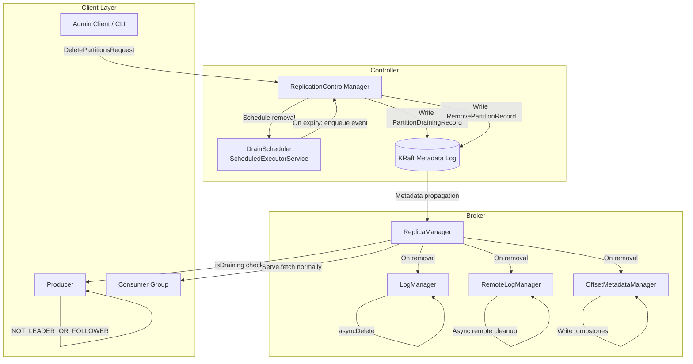

### New Metadata Records

#### PartitionDrainingRecord (ID 29)

File: `metadata/src/main/resources/common/metadata/PartitionDrainingRecord.json`

```json
{
  "apiKey": 29,
  "type": "metadata",
  "name": "PartitionDrainingRecord",
  "validVersions": "0",
  "flexibleVersions": "0+",
  "fields": [
    {
      "name": "TopicId",
      "type": "uuid",
      "versions": "0+",
      "about": "The unique ID of the topic whose partitions are being drained."
    },
    {
      "name": "PartitionIds",
      "type": "[]int32",
      "versions": "0+",
      "about": "The partition IDs entering the draining state. These are always the tail partitions: [currentCount - deleteCount, ..., currentCount - 1]."
    },
    {
      "name": "DrainDeadlineMs",
      "type": "int64",
      "versions": "0+",
      "about": "The absolute wall-clock timestamp (ms since epoch) after which the controller will write RemovePartitionRecords for these partitions."
    }
  ]
}
```

#### RemovePartitionRecord (ID 30)

File: `metadata/src/main/resources/common/metadata/RemovePartitionRecord.json`

```json
{
  "apiKey": 30,
  "type": "metadata",
  "name": "RemovePartitionRecord",
  "validVersions": "0",
  "flexibleVersions": "0+",
  "fields": [
    {
      "name": "TopicId",
      "type": "uuid",
      "versions": "0+",
      "about": "The unique ID of the topic."
    },
    {
      "name": "PartitionId",
      "type": "int32",
      "versions": "0+",
      "about": "The partition ID to permanently remove. After replay, this partition no longer exists in any metadata image."
    }
  ]
}
```

**Design decision: Why two records instead of one?**

Separating draining initiation from removal provides:

1. **Crash safety** — If the controller crashes between writing `PartitionDrainingRecord` and the deadline, the new
   controller replays the record and knows exactly which partitions are draining and when they should be removed.
2. **Auditability** — Operators can inspect the metadata log and see exactly when draining started and when removal
   happened.
3. **Cancellation (future)** — A future `CancelPartitionDrainingRecord` could revert the draining state without
   requiring a removal record.

---

### State Machine

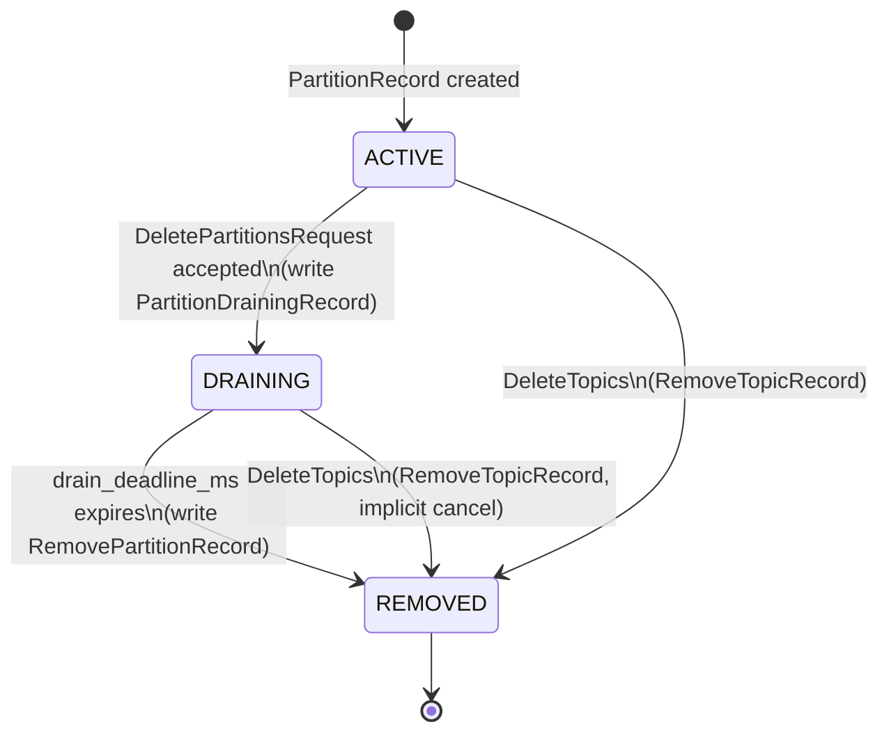

**Invariant:** A partition is in exactly one state at any time. State is derived from metadata replay:

- No `PartitionDrainingRecord` for this partition → ACTIVE
- `PartitionDrainingRecord` written, no `RemovePartitionRecord` → DRAINING
- `RemovePartitionRecord` written → REMOVED (partition no longer in TopicImage)

---

### Replica Lifecycle During Partition Deletion

This section defines how replicas (leader and followers) behave through each state transition, covering normal
operation, failure scenarios, and recovery. This is the most complex part of the design because it intersects with
replication, leader election, transactions, controlled shutdown, and log cleanup.

#### Design Principles

1. **Draining partitions maintain full replication** — Consumers need the partition to be available for reads;
   if the leader fails, a follower must be able to take over.
2. **Removal does not wait for broker acknowledgment** — The controller writes `RemovePartitionRecord` regardless
   of which brokers are online. Offline brokers clean up when they rejoin.
3. **Drain deadline is a wall-clock hard deadline** — It never pauses, regardless of partition or broker availability.
   This is consistent with `retention.ms` behavior.
4. **Transaction control records bypass draining write block** — To allow in-flight transactions to resolve cleanly.

#### During DRAINING: Replication Behavior

| Mechanism                           | Behavior                          | Rationale                                                                              |
|-------------------------------------|-----------------------------------|----------------------------------------------------------------------------------------|
| Follower fetch from leader          | **Continues normally**            | Leader failover requires caught-up followers                                           |
| ISR expansion (follower catches up) | **Allowed**                       | More ISR members = better availability during drain                                    |
| ISR shrink (follower falls behind)  | **Allowed**                       | Normal ISR mechanism; no special handling                                              |
| Leader epoch increment              | **Allowed**                       | If leadership changes, epoch must advance                                              |
| High watermark propagation          | **Continues**                     | Consumers rely on HW to determine readable data                                        |
| `min.insync.replicas` enforcement   | **Not enforced** (no data writes) | min.isr only applies to produce with acks=all; draining partitions reject data produce |
| Preferred leader election           | **Allowed**                       | Consumer benefits from optimal read path                                               |
| Unclean leader election             | **Follows topic config**          | If `unclean.leader.election.enable=true`, allow; no override for draining              |

**Why maintain full replication during draining?**

If replication stopped during draining and the leader died, consumers would lose access to unconsumed data —
defeating the entire purpose of the drain period. The cost of maintaining idle replication (no new data flowing)
is negligible compared to the risk of data inaccessibility.

#### During DRAINING: Failure Scenarios

##### Scenario A: Leader Crashes

```
Partition 8: replicas=[B0*, B1, B2], ISR=[B0, B1, B2], state=DRAINING
                                                        (* = leader)
B0 crashes:
  1. Controller detects B0 fenced (heartbeat timeout)
  2. Controller elects new leader from ISR (e.g., B1)
  3. Writes PartitionChangeRecord { topicId, partitionId=8, leader=B1, leaderEpoch++ }
  4. B1 becomes leader; consumers reconnect to B1
  5. Draining state unchanged; drain deadline unchanged
  6. B2 continues fetching from new leader B1
```

No special handling. Identical to ACTIVE partition leader failure.

##### Scenario B: All ISR Members Crash (Leader Included)

```
Partition 8: replicas=[B0*, B1, B2], ISR=[B0, B1], state=DRAINING
B0 and B1 both crash.

Case 1: unclean.leader.election.enable=true
  → Controller elects B2 (out-of-ISR) as leader
  → Consumers reconnect to B2 (may see fewer messages due to lag)
  → Draining continues

Case 2: unclean.leader.election.enable=false
  → No leader elected; partition becomes unavailable
  → Consumers cannot fetch → they will experience errors
  → Drain deadline continues ticking (NOT paused)
  → If deadline expires while partition is unavailable:
    - Controller writes RemovePartitionRecord
    - When B0/B1 recover, they replay RemovePartitionRecord and delete local logs
    - Data that was unavailable during the outage is permanently lost
```

**Design decision: Deadline does NOT pause during unavailability.**

Rationale:

- Pausing requires tracking "available time" vs "wall-clock time" — complex state
- A partition where ALL replicas are permanently offline has no recoverable data anyway
- If replicas are temporarily down and recover before deadline, consumers can resume
- Operator set the timeout knowing their cluster's reliability characteristics
- Consistent with `retention.ms` — retention doesn't pause during outages

##### Scenario C: Follower Crashes (Leader Alive)

```
Partition 8: replicas=[B0*, B1, B2], ISR=[B0, B1, B2], state=DRAINING
B2 crashes.

  1. ISR shrinks to [B0, B1] (normal ISR shrink mechanism)
  2. Consumer unaffected (still fetching from leader B0)
  3. No impact on draining behavior
  4. If B2 recovers before deadline: re-joins ISR, resumes fetching
  5. If B2 recovers after removal: finds stale log dir, deletes it
```

##### Scenario D: Follower Permanently Gone (Never Recovers)

```
Partition 8: replicas=[B0*, B1, B2], ISR=[B0, B1], state=DRAINING
B2 is decommissioned / never coming back.

  After RemovePartitionRecord is written:
  → B0 and B1 delete their local logs
  → B2's log dir remains as an orphan on its (dead) disk
  → No cluster impact; the data is simply abandoned on dead hardware
  → If B2's disk is later attached to a new broker:
    - New broker starts with fresh metadata
    - StalePartitionDirectoryDetector identifies orphan → schedules cleanup
```

#### During DRAINING: Controlled Shutdown

```
Partition 8: replicas=[B0*, B1, B2], ISR=[B0, B1, B2], state=DRAINING
B0 initiates controlled shutdown.

  1. B0 sends BrokerHeartbeat with wantShutDown=true
  2. Controller migrates leadership: writes PartitionChangeRecord { leader=B1 }
  3. B1 becomes new leader for partition 8
  4. Consumers reconnect to B1
  5. B0 shuts down; its replica data remains on disk
  6. Draining continues under B1's leadership

When B0 restarts:
  - If partition still draining: B0 resumes as follower, fetches from B1
  - If partition already removed: B0 finds stale dir, deletes it
```

No special handling. Standard controlled shutdown leadership migration applies to draining partitions.

#### During DRAINING: Transaction Control Records

When a transactional producer has an open transaction that includes a draining partition, the transaction must
be resolved (committed or aborted). This requires writing a COMMIT or ABORT control record to the partition.

```
Transaction T1: partitions=[P5, P8], state=ONGOING
P8 enters DRAINING

  1. Producer's next Produce(data) to P8 → NOT_LEADER_OR_FOLLOWER
  2. Producer calls abortTransaction() (or transaction.timeout.ms expires)
  3. TransactionCoordinator transitions T1 to PREPARE_ABORT
  4. TransactionCoordinator writes ABORT marker to P8:
     - This is a control batch (ControlRecordType.ABORT)
     - Draining partition ALLOWS control batch writes
     - ISR requirement relaxed: acks=1 (leader-only) sufficient
       (partition is being deleted; marker durability is low priority)
  5. TransactionCoordinator completes abort → T1 state = COMPLETE_ABORT
```

**Implementation: Produce handler draining bypass logic**

```java
// In ReplicaManager / Partition appendRecords path:
if(partition.isDraining()){
        if(batch.

isControlBatch()){

// Allow COMMIT/ABORT markers through with relaxed acks
// Reason: transaction must resolve; partition will be deleted soon anyway
appendToLocalLog(records);
// Do NOT require ISR ack — just leader write is sufficient
    }else{
            // Reject normal data writes
            return Errors.NOT_LEADER_OR_FOLLOWER;
    }
            }
```

**Why relax ISR requirement for control records?**

- If ISR has shrunk below `min.insync.replicas` (due to follower failures during drain), a strict `acks=all`
  requirement would block the transaction abort marker forever
- This creates a deadlock: transaction can't resolve → TransactionCoordinator keeps retrying → partition
  can't be removed → operator is stuck
- Since the partition is being deleted, the durability of the marker is irrelevant — what matters is that
  the TransactionCoordinator transitions the transaction to a terminal state
- If the leader crashes after writing the marker locally (before follower replication), the
  TransactionCoordinator will retry the marker write to the new leader

**Edge case: Transaction COMMIT marker to draining partition**

Same behavior as ABORT — allowed through with relaxed acks. The committed data in the draining partition
will eventually be lost when the partition is removed. The important thing is that the transaction reaches
a terminal state so the producer can proceed with new transactions.

**Edge case: AddPartitionsToTxn for draining partition**

- Not possible. After metadata refresh, the draining partition doesn't appear in the producer's partition
  list. The producer cannot add a draining partition to a new transaction.
- For pre-existing transactions that already include the draining partition (added before draining started),
  only COMMIT/ABORT markers need to flow.

#### On REMOVAL: Broker-Side Replica Cleanup

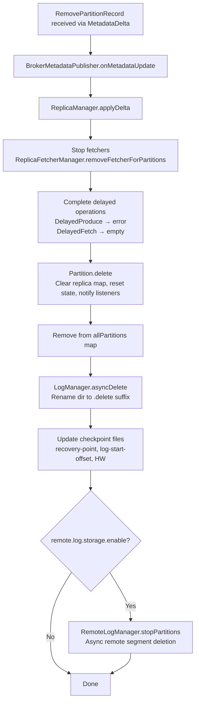

When a broker receives `RemovePartitionRecord` via `MetadataDelta` → `BrokerMetadataPublisher.onMetadataUpdate()`:

```
ReplicaManager.applyDelta() processes the removal:

1. STOP FETCHERS (if this broker is a follower):
   - ReplicaFetcherManager.removeFetcherForPartitions({partition})
   - Removes partition from AbstractFetcherThread.partitionStates
   - Unregisters lag metrics for this partition

2. COMPLETE IN-FLIGHT DELAYED OPERATIONS:
   - Any DelayedProduce waiting on this partition → complete with error
   - Any DelayedFetch waiting on this partition → complete with empty response
   - Purgatory watchKeys for this partition removed

3. STOP PARTITION:
   - Partition.delete() called:
     a. Acquires leaderIsrUpdateLock (write)
     b. Clears remoteReplicasMap
     c. Resets assignmentState, log, futureLog
     d. Invokes onDeleted() listeners (RemoteLogManager cleanup)
     e. Removes partition-level metrics

4. REMOVE FROM REPLICA MAP:
   - allPartitions.remove(topicPartition)
   - Partition object becomes eligible for GC

5. ASYNC LOG DELETION:
   - LogManager.asyncDelete(topicPartition, checkpoint=true):
     a. Removes from currentLogs / futureLogs map
     b. Aborts any pending log cleaner tasks for this partition
     c. Renames log directory: "{topic}-{partition}" → "{topic}-{partition}.{uuid}-delete"
     d. Adds to logsToBeDeleted queue (background thread processes)
     e. Updates checkpoint files (recovery-point-offset, log-start-offset)
        to exclude the deleted partition

6. REMOTE STORAGE CLEANUP (if remote.log.storage.enable=true):
   - RemoteLogManager.stopPartitions(StopPartition(tp, deleteRemoteLog=true)):
     a. Schedules async deletion of remote log segments
     b. Cleans remote log metadata via RemoteLogMetadataManager
     c. May take significant time (cloud storage API calls)

7. CHECKPOINT FILE UPDATES:
   - recovery-point-offset-checkpoint: rewritten excluding this partition
   - log-start-offset-checkpoint: rewritten excluding this partition
   - replication-offset-checkpoint (HW): rewritten excluding this partition
   All three checkpoints updated atomically per log directory.
```

#### On REMOVAL: Offline Broker Recovery

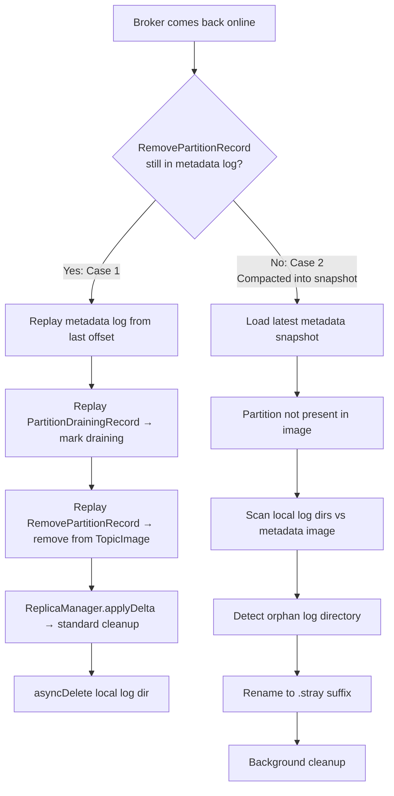

When a broker that was offline during partition removal comes back:

```
Case 1: RemovePartitionRecord still in metadata log (not yet snapshotted)
  1. Broker connects to Raft cluster, replays metadata log from last known offset
  2. Replays PartitionDrainingRecord (may be present) → marks partition draining in local image
  3. Replays RemovePartitionRecord → removes partition from local TopicImage
  4. BrokerMetadataPublisher.onMetadataUpdate() called with delta showing partition removed
  5. ReplicaManager.applyDelta() processes removal → same cleanup as above
  6. If local log dir exists for removed partition → asyncDelete cleans it up

Case 2: RemovePartitionRecord already compacted into metadata snapshot
  1. Broker loads latest metadata snapshot → partition not present in image
  2. Broker scans local log directories vs metadata image
  3. Finds "orphan" log directory for partition that doesn't exist in metadata
  4. Marks as stale → renames to "{topic}-{partition}.{uuid}-stray"
  5. Stray directories cleaned up by background process
     (This is the existing "stale partition directory" detection mechanism)
```

#### On REMOVAL: Remote Storage Segment Lifecycle

For topics with tiered storage enabled (`remote.log.storage.enable=true`):

```
Timeline:
  T0: Partition is ACTIVE; some segments uploaded to remote storage
  T1: Partition enters DRAINING; no new data → no new remote uploads
      (existing uploaded segments remain accessible for consumer fetch)
  T2: Partition enters REMOVED
      → RemoteLogManager.stopPartitions(deleteRemoteLog=true)
      → Async remote segment deletion begins:
        a. Enumerate remote segments for this partition
        b. Delete each segment from remote storage (S3/GCS/HDFS)
        c. Delete remote log metadata entries
      → Deletion may take minutes/hours for large partitions
      → No impact on broker operation (async, fire-and-forget with retries)
```

**Edge case: Consumer fetching from remote storage during removal**

- After `RemovePartitionRecord` is replayed, the broker stops serving fetch requests for this partition
- Any in-flight remote fetch returns an error
- The consumer refreshes metadata and discovers the partition is gone
- Remote segments become inaccessible immediately from the client's perspective, even if the async
  deletion hasn't completed yet

#### Replica Lifecycle Summary Table

| Event                              | Leader Behavior                                                       | Follower Behavior                    | Controller Action                                                     |
|------------------------------------|-----------------------------------------------------------------------|--------------------------------------|-----------------------------------------------------------------------|
| Partition enters DRAINING          | Rejects data produce; allows control batches; continues serving fetch | Continues fetching from leader       | Writes PartitionDrainingRecord                                        |
| Leader crashes during DRAINING     | N/A (dead)                                                            | One follower elected leader from ISR | Writes PartitionChangeRecord (new leader)                             |
| All replicas crash during DRAINING | N/A                                                                   | N/A                                  | Deadline continues; on expiry writes RemovePartitionRecord regardless |
| Controlled shutdown of leader      | Steps down leadership                                                 | New leader elected                   | Writes PartitionChangeRecord                                          |
| Drain deadline expires             | Still serving fetch until RemovePartitionRecord arrives               | Still fetching                       | Writes RemovePartitionRecord per partition                            |
| RemovePartitionRecord replayed     | Stops serving; deletes log                                            | Stops fetching; deletes log          | N/A (already written)                                                 |
| Broker recovers after removal      | Finds stale dir; async delete                                         | Finds stale dir; async delete        | No action needed                                                      |

---

### Command Workflows

#### Delete Partitions (Happy Path)

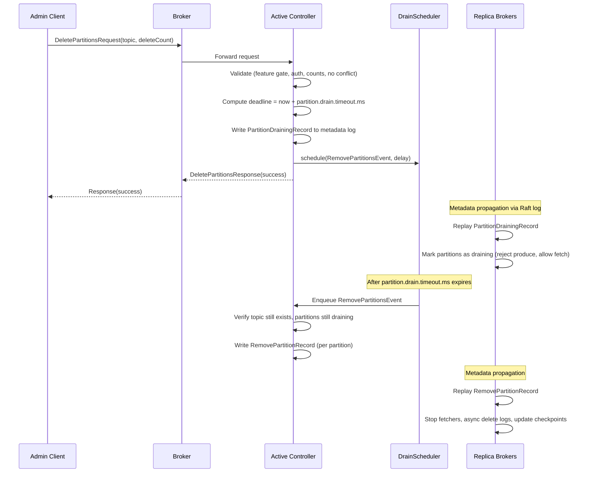

#### Producer Convergence on Draining Partition

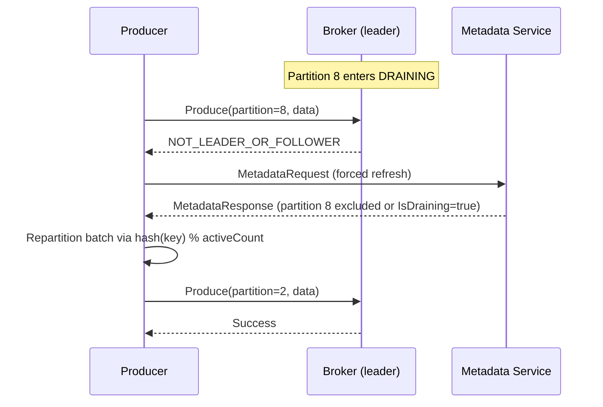

#### Consumer Rebalance on Partition Removal

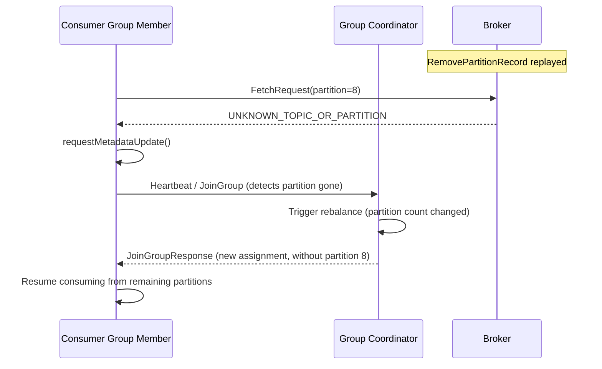

#### Transaction Resolution During Draining

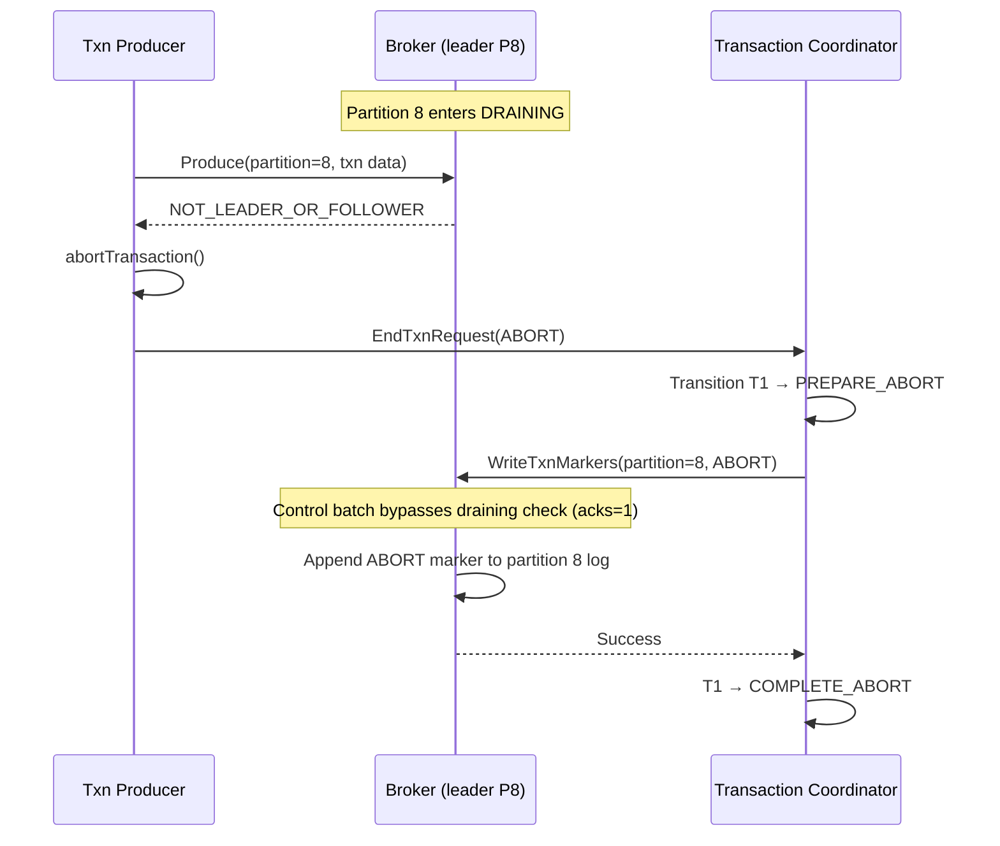

---

### Controller Behavior

#### Processing DeletePartitionsRequest

Location: `metadata/src/main/java/org/apache/kafka/controller/ReplicationControlManager.java`

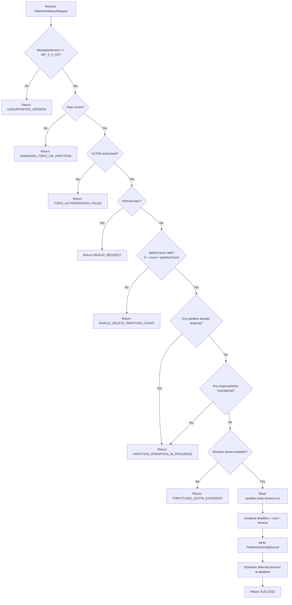

```
For each topic in request:
  1. Feature gate: if metadataVersion < IBP_4_4_IV2 → UnsupportedVersionException
  2. Resolve topic name → TopicControlInfo
     - Not found → UNKNOWN_TOPIC_OR_PARTITION (3)
  3. Authorization: require ALTER on topic
     - Denied → TOPIC_AUTHORIZATION_FAILED (29)
  4. Internal topic check: if Topic.isInternal(name) → INVALID_REQUEST (42)
     - Cannot delete partitions from __consumer_offsets, __transaction_state, etc.
  5. Validate deleteCount:
     - deleteCount <= 0 → INVALID_DELETE_PARTITION_COUNT (137)
     - deleteCount >= currentPartitionCount → INVALID_DELETE_PARTITION_COUNT (137)
  6. Check no existing draining operation:
     - Any partition in this topic already in DRAINING state → PARTITION_OPERATION_IN_PROGRESS (136)
  7. Check no active reassignment on targeted partitions:
     - Compute targetPartitionIds = [currentCount - deleteCount, ..., currentCount - 1]
     - For each targetPartitionId: if partitionRegistration.isReassigning() → PARTITION_OPERATION_IN_PROGRESS (136)
       (isReassigning = removingReplicas non-empty OR addingReplicas non-empty)
  8. Apply partition mutation quota:
     - context.applyPartitionChangeQuota(deleteCount)
     - If throttled → THROTTLING_QUOTA_EXCEEDED (89)
  9. Read topic config: partition.drain.timeout.ms (default 3600000)
  10. Compute absolute deadline: controller.time.milliseconds() + drainTimeoutMs
  11. Write PartitionDrainingRecord { topicId, targetPartitionIds, drainDeadlineMs }
  12. Schedule deferred removal event at drainDeadlineMs
  13. Return success
```

#### Deferred Removal Event (Deadline Expiry) — Timer Mechanism

The KRaft controller does not have a native wall-clock timer for deferred events. The existing `DeferredEventQueue`
is offset-based (completes when metadata log advances past an offset). We need a wall-clock scheduling mechanism
for drain deadlines.

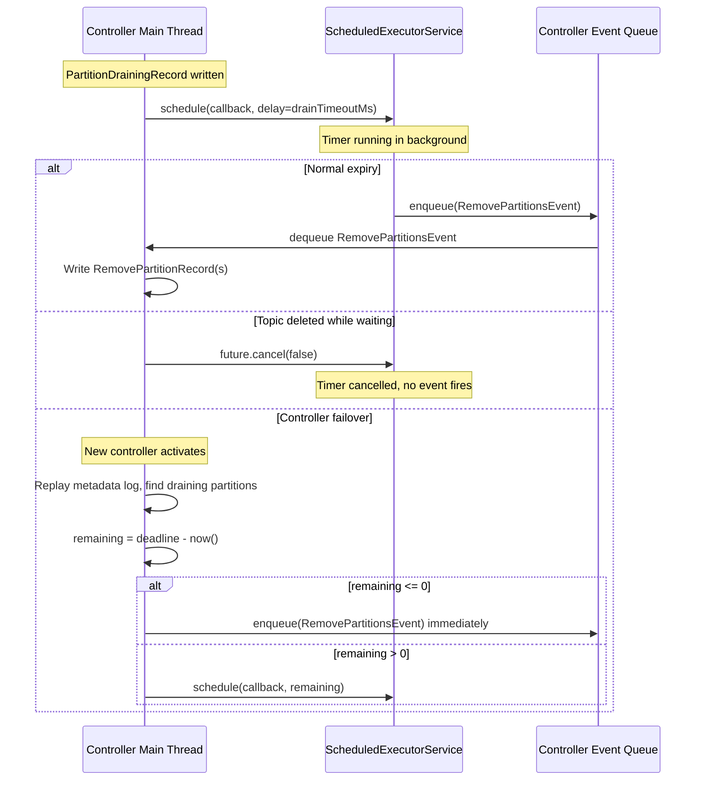

**Chosen approach: `ScheduledExecutorService` + Controller Event Queue**

```java
// In QuorumController:
private final ScheduledExecutorService drainScheduler =
    Executors.newSingleThreadScheduledExecutor(
        new ThreadFactory("controller-drain-scheduler"));

// Maps topicId → scheduled future (for cancellation on topic deletion)
private final Map<Uuid, ScheduledFuture<?>> pendingDrainRemovals = new ConcurrentHashMap<>();
```

**Scheduling flow:**

```
On PartitionDrainingRecord write:
  1. Compute delay = drainDeadlineMs - controller.time.milliseconds()
  2. If delay <= 0:
     - Enqueue RemovePartitionsEvent immediately
  3. If delay > 0:
     - ScheduledFuture<?> future = drainScheduler.schedule(() -> {
         controllerEventQueue.enqueue(new RemovePartitionsEvent(topicId, partitionIds));
       }, delay, TimeUnit.MILLISECONDS);
     - pendingDrainRemovals.put(topicId, future);
```

**RemovePartitionsEvent handler (runs on controller thread):**

```
1. Verify topic still exists (may have been deleted while waiting)
2. Verify partitions are still in DRAINING state (defensive check)
3. For each partitionId:
   - Write RemovePartitionRecord { topicId, partitionId }
4. pendingDrainRemovals.remove(topicId)
```

**Cancellation (topic deleted while draining):**

```
On RemoveTopicRecord replay:
  ScheduledFuture<?> future = pendingDrainRemovals.remove(topicId);
  if (future != null) {
      future.cancel(false);  // Don't interrupt if already running
  }
```

**Controller failover recovery:**

```
On controller activation (after metadata log replay):
  For each topic with draining partitions in TopicImage:
    long remaining = drainDeadlineMs - controller.time.milliseconds();
    if (remaining <= 0):
      // Deadline already passed; schedule immediate removal
      controllerEventQueue.enqueue(new RemovePartitionsEvent(topicId, partitionIds));
    else:
      // Re-schedule for remaining time
      drainScheduler.schedule(() -> {
          controllerEventQueue.enqueue(new RemovePartitionsEvent(topicId, partitionIds));
      }, remaining, TimeUnit.MILLISECONDS);
```

**Why ScheduledExecutorService over other approaches:**

| Approach | Precision | CPU Cost | Complexity | Chosen? |
|----------|:---------:|:--------:|:----------:|:-------:|
| Tick-based polling (check on every tick) | ~500ms | O(N) per tick for N draining topics | Low | No — wasteful if many topics drain; imprecise |
| Purgatory TimingWheel | O(1) | O(1) | High — needs extra thread, synchronization, not designed for controller | No — over-engineered for this use case |
| ScheduledExecutorService | ms-level | O(1) — fires only when needed | Medium | **Yes** |

**Thread safety guarantee:** The `ScheduledExecutorService` callback does NOT write metadata directly. It only
enqueues an event onto `controllerEventQueue`. The actual `RemovePartitionRecord` write happens on the single
controller thread, maintaining the controller's single-writer guarantee.

**Shutdown:** On controller deactivation, `drainScheduler.shutdownNow()` cancels all pending tasks.
On reactivation, tasks are re-scheduled from replayed metadata state.

#### Replay of PartitionDrainingRecord (MetadataDelta)

```java
// In TopicsDelta.java
public void replay(PartitionDrainingRecord record) {
    TopicDelta topicDelta = getOrCreateTopicDelta(record.topicId());
    topicDelta.replayPartitionDraining(record);
}

// In TopicDelta.java
public void replayPartitionDraining(PartitionDrainingRecord record) {
    for (int partitionId : record.partitionIds()) {
        PartitionRegistration existing = image.partitions().get(partitionId);
        if (existing != null) {
            partitionChanges.put(partitionId, existing.toBuilder().setDraining(true).build());
        }
    }
    this.drainDeadlineMs = record.drainDeadlineMs();
}
```

#### Replay of RemovePartitionRecord (MetadataDelta)

```java
// In TopicsDelta.java
public void replay(RemovePartitionRecord record) {
    TopicDelta topicDelta = getOrCreateTopicDelta(record.topicId());
    topicDelta.replayRemovePartition(record);
}

// In TopicDelta.java
public void replayRemovePartition(RemovePartitionRecord record) {
    partitionChanges.put(record.partitionId(), null); // null signals removal from TopicImage
}
```

#### Controller Failover Recovery

On new controller activation (replay of metadata log):

1. All `PartitionDrainingRecord` entries are replayed → draining state restored in TopicImage
2. Controller checks all draining sets against current wall-clock time
3. If deadline already passed → immediately schedule `RemovePartitionRecord` writes
4. If deadline in future → register for checking on next tick

---

### Broker Behavior

#### Produce Request Handling (Draining Check)

```mermaid
flowchart TD
    A[Produce Request arrives for partition P] --> B{Partition P exists in allPartitions?}
    B -->|No| Z1[Return UNKNOWN_TOPIC_OR_PARTITION]
    B -->|Yes| C{P.isDraining()?}
    C -->|No| D[Normal produce path]
    C -->|Yes| E{Is control batch?\nCOMMIT/ABORT marker}
    E -->|Yes| F[Allow through with acks=1\nRelaxed ISR requirement]
    E -->|No| Z2[Return NOT_LEADER_OR_FOLLOWER]
    F --> G[Append to local log]
    D --> H[Append to local log + ISR ack]
```

#### Produce Requests to Draining Partitions

Location: `server/src/main/java/org/apache/kafka/server/ReplicaManager.java` (or equivalent)

When a produce request targets a draining partition:

- Return `NOT_LEADER_OR_FOLLOWER` (6) as the partition-level error
- This is intentionally reusing an existing error code because:
    1. Producers already handle this error by refreshing metadata
    2. After metadata refresh, the producer's partition list won't include the draining partition (v0-v13) or will skip
       it (v14)
    3. No client-side code changes required for existing producers

#### Fetch Requests to Draining Partitions

- Serve normally. Consumers continue to read from draining partitions.
- The consumer needs this data to drain its lag before the partition is removed.

#### ListOffsets / OffsetFetch / OffsetCommit

- Serve normally for draining partitions.
- Consumers may still commit offsets for draining partitions.

#### Delayed Produce Operations

If a `DelayedProduce` (acks=all) is in-flight when a partition transitions to DRAINING:

- `DelayedProduce.tryComplete()` already handles the case where the replica is no longer leader (Case B in existing
  code)
- The partition's leadership is not changed during draining, but the validation check will detect draining state and
  complete the delayed operation with an error
- Add draining check to `PartitionStatusValidator`: if partition is draining, return error immediately

#### Delayed Fetch Operations

- `DelayedFetch` operations continue normally for draining partitions
- Consumers can still fetch; no change needed

#### On RemovePartitionRecord (Partition Fully Removed)

When broker receives `RemovePartitionRecord` via metadata update, the detailed cleanup flow is described in the
"Replica Lifecycle During Partition Deletion → On REMOVAL: Broker-Side Replica Cleanup" section above. Summary:

```
1. Stop fetchers (if follower) via ReplicaFetcherManager.removeFetcherForPartitions()
2. Complete in-flight delayed operations (DelayedProduce/DelayedFetch) with error
3. Partition.delete() — clear state, notify listeners (RemoteLogManager), remove metrics
4. Remove from allPartitions map
5. LogManager.asyncDelete() — rename dir to ".delete" suffix, queue for background cleanup
6. Update checkpoint files (recovery-point, log-start-offset, HW)
7. Remote storage cleanup (if enabled) — async segment deletion
```

---

### Producer Behavior

#### Metadata Update and Key Routing

**For producers using MetadataResponse v0–v13 (majority of existing deployments):**

The broker constructs the MetadataResponse by **excluding** draining partitions from the partition list. The producer
sees a reduced partition count and immediately rehashes: `hash(key) % newActiveCount`.

This means:

- Keys that previously mapped to partitions 0 through (newCount-1) MAY remap (since `% newCount` differs from
  `% oldCount`)
- Keys that previously mapped to the removed tail partitions WILL remap
- **This is a one-time disruption.** After the metadata refresh settles, routing is stable.

**For producers using MetadataResponse v14:**

Draining partitions appear with `IsDraining=true`. The producer's `Cluster.availablePartitionsForTopic()` method
filters them out. Same effective behavior, but the producer can log a warning about draining partitions for
observability.

**Sticky partitioner impact:**

The `StickyPartitionCache` (for null-key messages) naturally adapts: when the current sticky partition becomes
unavailable (draining), the next `nextPartition()` call picks from the remaining active partitions.

#### Producer Convergence Timeline (Detailed)

When a partition enters DRAINING, the producer must discover this change. There are two discovery paths:

**Path 1: Error-driven discovery (fast, ~1 RTT)**

```
Timeline:
  T0: Controller writes PartitionDrainingRecord
  T1: Broker receives metadata update (near-instant via Raft log)
  T2: Producer sends Produce to draining partition
  T3: Broker returns NOT_LEADER_OR_FOLLOWER (partition-level error)
  T4: Producer calls metadata.requestUpdate(false) — forces immediate metadata refresh
  T5: Producer receives new metadata (draining partition excluded or IsDraining=true)
  T6: Producer retries batch → routed to active partition

  Convergence time: T6 - T2 ≈ 1-2 network RTTs (typically 2-10ms in same DC)
```

This path is **the dominant path** for active producers. As soon as one batch fails, metadata is refreshed.

**Path 2: Periodic refresh discovery (slow, up to `metadata.max.age.ms`)**

```
Timeline:
  T0: Controller writes PartitionDrainingRecord
  T1: Broker receives metadata update
  ...
  T(idle): Producer has no pending batches for draining partition
  T(refresh): metadata.max.age.ms expires (default 5 minutes = 300000ms)
  T(refresh): Producer fetches new metadata → discovers draining partition excluded

  Convergence time: up to metadata.max.age.ms (worst case 5 minutes)
```

This path applies to **idle producers** that happen to have the draining partition's metadata cached but aren't
actively writing to it. No impact on data flow — they just hold stale metadata until periodic refresh.

**Worst case for active producers:** Even with the error-driven path, there is a brief window where the broker
has received the draining metadata update but the producer hasn't learned yet. During this window:
- Batch is in-flight → broker returns NOT_LEADER_OR_FOLLOWER
- Producer retries the batch (if `retries > 0` and `delivery.timeout.ms` not exceeded)
- Each retry takes ~1 RTT until metadata is refreshed

**Maximum message delay due to partition draining:**
```
delay = time_for_produce_attempt + time_for_metadata_refresh + time_for_retry
      ≈ retry_backoff_ms + metadata_fetch_RTT + produce_RTT
      ≈ 100ms + 5ms + 5ms = ~110ms (typical)
```

#### Producer Retry Behavior with retries + delivery.timeout.ms

When a produce to a draining partition returns `NOT_LEADER_OR_FOLLOWER`:

```java
// Sender.java canRetry() logic:
boolean canRetry =
    !batch.hasReachedDeliveryTimeout(deliveryTimeoutMs, now)  // delivery.timeout.ms not exceeded
    && batch.attempts() < retries                              // retry count not exhausted
    && error.exception() instanceof RetriableException;        // NOT_LEADER_OR_FOLLOWER is retriable

// If canRetry == true:
//   1. metadata.requestUpdate(false) — schedule metadata refresh
//   2. reenqueueBatch(batch, now) — re-queue batch for retry after backoff
//   3. Next attempt uses refreshed metadata → routes to active partition

// If canRetry == false (delivery.timeout.ms exceeded):
//   1. batch.done() with TimeoutException
//   2. Producer callback receives TimeoutException
//   3. Message is LOST (from producer's perspective)
```

**Key insight:** `NOT_LEADER_OR_FOLLOWER` is classified as `InvalidMetadataException` (which extends
`RetriableException`). This means the producer's existing retry logic handles draining partitions
correctly with **zero code changes** to the producer.

**Scenario: delivery.timeout.ms too short**

```
Producer config: delivery.timeout.ms=5000 (5s), retries=3, retry.backoff.ms=100

T0: Batch appended to RecordAccumulator for partition 8
T1 (4.9s later): Batch finally sent (was stuck behind other batches or linger.ms)
T2: Broker returns NOT_LEADER_OR_FOLLOWER
T3: delivery.timeout.ms exceeded → batch.done(TimeoutException)
     → Message LOST

Fix: This is a pre-existing producer misconfiguration, not specific to draining.
     delivery.timeout.ms should always be >> linger.ms + request.timeout.ms.
```

**Scenario: retries=0 (no retry)**

```
Producer config: retries=0

T0: Produce to draining partition → NOT_LEADER_OR_FOLLOWER
T1: canRetry = false (retries exhausted)
T2: Callback receives NotLeaderOrFollowerException
     → Message LOST

Note: retries=0 is a deliberate "fire and forget" config. The producer explicitly
accepts message loss. Not specific to draining.
```

---

### Consumer Behavior

#### During DRAINING State

- Consumer group assignment **still includes** draining partitions
- Consumers continue to fetch and commit offsets normally
- The group coordinator does NOT trigger rebalance just because partitions entered draining
- This allows consumers to drain remaining data in the partition
- Consumer continues to see data in the partition (all data written before draining started)
- High watermark continues to be served correctly

#### Consumer Lag Draining to Zero

```
Timeline for a consumer fetching from draining partition 8:
  T0: Partition 8 enters DRAINING. Current end offset = 1000. Consumer position = 800.
      Lag = 200 messages.
  T1: Consumer fetches batches, position advances: 800 → 900 → 950 → 1000
  T2: Consumer position = end offset. Lag = 0.
  T3: Subsequent fetch requests return empty (no new data, since produce is blocked)
  T4: Consumer remains assigned to partition 8, polling returns empty batches
  ...
  T(deadline): partition.drain.timeout.ms expires
  T(deadline+1): RemovePartitionRecord written → partition removed → rebalance
```

**After lag reaches 0:**
- Consumer continues polling (returns empty `ConsumerRecords`)
- No harm — it's just idle polling
- On removal, rebalance removes partition 8 from assignment
- Consumer continues with remaining partitions

**Design decision: Why not complete the drain early when lag=0?**
- Not all consumers are in registered consumer groups (manual assign, Streams)
- New consumers could start consuming during the drain period
- "All known consumer groups at lag=0" is not the same as "all consumers have consumed everything"
- Fixed timeout is predictable and eliminates this class of ambiguity

#### Consumer Disconnect and Reconnect During Draining

```
Scenario: Consumer C1 is assigned partition 8 (DRAINING). C1 crashes.

T0: C1 crashes. Session timeout starts (session.timeout.ms, default 45s).
T1 (+45s): Group coordinator triggers rebalance due to C1 timeout.
T2: Remaining consumers C2, C3 get new assignment.
    Partition 8 (still DRAINING) is assigned to C2.
T3: C2 starts fetching from partition 8 at C1's last committed offset.
    C2 drains remaining data.

If C1 recovers before session timeout:
  → C1 re-joins group, may get partition 8 back (or another member gets it)
  → Either way, draining partition continues to be consumed
```

**No special handling needed.** Standard consumer group rebalance handles this. The key property is that
draining partitions remain in the assignment pool throughout the drain period.

#### Manual Assignment Consumers (assign())

Consumers using `consumer.assign(List<TopicPartition>)` do NOT participate in consumer group rebalance.
They will NOT be automatically notified when a partition is removed.

**During DRAINING:**
- Manually assigned consumer continues to fetch from draining partition normally
- No issue — same as consumer group member

**On REMOVAL:**
```
T0: Partition 8 removed (RemovePartitionRecord replayed)
T1: Consumer calls poll() → sends fetch request to broker for partition 8
T2: Broker returns UNKNOWN_TOPIC_OR_PARTITION for partition 8
T3: Consumer logs warning, triggers metadata refresh
T4: Consumer's metadata no longer includes partition 8
T5: Consumer continues calling poll() but partition 8 returns errors
T6: Consumer does NOT automatically remove partition 8 from assignment
    → User code must detect this and call assign() with updated partition list
```

**Consumer-side detection for manual assign users:**

```java
// Application code pattern for manual-assign consumers:
ConsumerRecords<K, V> records = consumer.poll(Duration.ofMillis(100));

// Check for partitions that are no longer valid
Set<TopicPartition> currentAssignment = consumer.assignment();
Set<TopicPartition> validPartitions = new HashSet<>();
for (TopicPartition tp : currentAssignment) {
    // If metadata shows topic exists but partition doesn't, it's been removed
    List<PartitionInfo> partitions = consumer.partitionsFor(tp.topic());
    if (partitions != null && partitions.stream().anyMatch(p -> p.partition() == tp.partition())) {
        validPartitions.add(tp);
    }
}
if (validPartitions.size() < currentAssignment.size()) {
    consumer.assign(validPartitions);  // Shrink assignment
}
```

**Documentation responsibility:** The AdminClient `deletePartitions()` Javadoc must warn operators that
manually assigned consumers require application-level handling.

#### Consumer In-Flight Fetch at Removal Instant

```
Timeline:
  T0: Consumer sends FetchRequest for partition 8 (DRAINING, data still available)
  T1: Broker receives RemovePartitionRecord (between receiving fetch and responding)
  T2: Broker processes the fetch:

  Case A: Metadata update applied BEFORE fetch processed
    → Partition no longer in allPartitions map
    → Broker returns UNKNOWN_TOPIC_OR_PARTITION for partition 8
    → Consumer triggers metadata refresh
    → On next poll, consumer discovers partition gone → rebalance (group) or error (manual assign)

  Case B: Metadata update applied AFTER fetch processed
    → Fetch returns data normally (last successful fetch)
    → On NEXT fetch, Case A applies
```

**Error handling in consumer (FetchCollector.java):**

```java
// When UNKNOWN_TOPIC_OR_PARTITION is received:
case UNKNOWN_TOPIC_OR_PARTITION:
    log.warn("Received unknown topic or partition error in fetch for partition {}", tp);
    requestMetadataUpdate(metadata, subscriptions, tp);
    break;
```

The consumer handles this gracefully:
1. Logs a warning
2. Requests metadata refresh
3. Does NOT crash or throw to user code
4. On next poll, metadata is refreshed and partition is gone
5. For group consumers: coordinator triggers rebalance
6. For manual-assign consumers: subsequent fetches for that partition keep failing until user removes it

#### Orphaned Offsets in __consumer_offsets

When a partition is removed, committed offsets for that partition remain in `__consumer_offsets` as orphaned entries.

**Cleanup mechanism:**

- The group coordinator's `OffsetMetadataManager.onTopicsDeleted()` generates tombstones when an entire topic is deleted
- For individual partition deletion, we extend this: `onPartitionsDeleted(topicId, removedPartitionIds)` generates
  tombstone records for offsets committed to those specific partitions across all consumer groups
- Tombstones are written to `__consumer_offsets` and will be compacted away

**Implementation:**

File: `group-coordinator/src/main/java/org/apache/kafka/coordinator/group/OffsetMetadataManager.java`

```java
/**
 * Called when individual partitions are removed from a topic (not full topic deletion).
 * Generates tombstone records for committed offsets to the removed partitions.
 */
public CoordinatorResult<Void, CoordinatorRecord> onPartitionsDeleted(
        Uuid topicId,
        Set<Integer> removedPartitionIds
) {
    List<CoordinatorRecord> records = new ArrayList<>();
    // Iterate all groups, find offsets committed to removed partitions, write tombstones
    offsetsByGroup.forEach((groupId, offsets) -> {
        offsets.forEach((tp, offsetAndMetadata) -> {
            if (tp.topicId().equals(topicId) && removedPartitionIds.contains(tp.partition())) {
                records.add(CoordinatorRecordHelpers.newOffsetCommitTombstoneRecord(groupId, tp));
            }
        });
    });
    return new CoordinatorResult<>(records);
}
```

---

### Deletion Failure Handling

Partition deletion involves multiple subsystems, each of which can fail independently. This section defines the
failure semantics and recovery strategies for each layer.

#### Layer 1: Controller Writes RemovePartitionRecord — Failure

**Can it fail?** Only if the controller loses Raft leadership mid-write.

**Behavior:**
- If the controller is fenced before the record is committed, the write is lost
- The draining state persists (PartitionDrainingRecord still in log)
- New controller activates → sees draining partitions → re-schedules removal
- On next deadline check, new controller writes RemovePartitionRecord
- **No data loss, no stuck state.** Self-healing via failover.

#### Layer 2: Broker Log Deletion (LogManager.asyncDelete) — Failure

**What can fail:**
- Disk full (cannot create `.delete` suffixed renamed directory)
- Permission error (filesystem permissions changed)
- I/O error (bad disk sectors)

**Existing behavior in LogManager:**

```java
// LogManager.deleteLogs() background thread:
try {
    removedLog.delete();
    LOG.info("Deleted log for partition {} in {}.", ...);
} catch (KafkaStorageException kse) {
    LOG.error("Exception while deleting {} in dir {}.", removedLog, removedLog.parentDir(), kse);
    // NO immediate retry — logs error and moves on
}
// Background thread reschedules itself after fileDeleteDelayMs
```

**Failure handling design:**

```
Step 1: asyncDelete() renames directory:
  "topic-8" → "topic-8.{uuid}-delete"
  
  If rename fails:
    → KafkaStorageException thrown
    → errorHandler callback invoked (ReplicaManager logs it)
    → Partition still exists as a local directory but is NOT served
      (already removed from allPartitions map and metadata image)
    → No client impact (partition is already removed from metadata)
    → Next LogManager startup scan detects orphan dir → retries deletion

Step 2: Background deletion thread processes ".delete" directories:
  
  If file deletion fails:
    → Logged at ERROR level
    → Directory remains on disk with ".delete" suffix
    → Background thread will retry on next scheduled run (fileDeleteDelayMs, default 60s)
    → On broker restart: LogManager.loadLogs() scans for ".delete" dirs, re-queues them
```

**Key guarantees:**
1. **Partition is gone from metadata** — regardless of whether local files are cleaned up
2. **Local cleanup is eventually consistent** — retries happen periodically
3. **No client impact from failed cleanup** — partition is already removed from all serving paths
4. **Crash-safe** — rename is atomic; `.delete` suffix survives broker restart
5. **Disk full edge case** — if rename itself fails (rare), directory becomes an orphan;
   detected as "stale partition" on next broker restart and re-queued for deletion

#### Layer 3: Remote Storage Deletion (RemoteLogManager.stopPartitions) — Failure

**What can fail:**
- Network error to cloud storage (S3/GCS/Azure)
- Cloud storage rate limiting or throttling
- Partial deletion (some segments deleted, others failed)

**Existing behavior in RemoteLogManager:**

```java
// RemoteLogManager.stopPartitions():
try {
    if (stopPartition.deleteRemoteLog) {
        deleteRemoteLogPartition(tpId);  // May throw RemoteStorageException
    }
} catch (Exception ex) {
    errorHandler.accept(tp, ex);  // Error passed to caller
    LOGGER.error("Error while stopping the partition: {}", stopPartition, ex);
}
```

**Failure handling design:**

```
If deleteRemoteLogPartition() fails:
  1. Exception logged at ERROR level
  2. errorHandler callback invoked
  3. Remote log segments remain in cloud storage (orphaned)
  4. Local partition cleanup continues (NOT blocked by remote failure)
  5. No client impact — partition already removed from metadata

Recovery:
  - Remote segment metadata still exists in RemoteLogMetadataManager
  - A background cleanup job (existing in RemoteLogManager) periodically scans
    for orphaned segments (segments whose partition no longer exists in metadata)
  - Orphaned segments are retried for deletion
  - If background cleanup is not yet implemented: segments remain as storage waste
    until manual operator intervention (cloud storage lifecycle policy)
```

**Cost of failed remote cleanup:**
- Storage cost of orphaned segments in cloud storage
- No correctness impact — partition is gone from metadata, consumers cannot access it
- This is acceptable for MVP; a background orphan-segment cleaner is a future enhancement

#### Layer 4: Offset Tombstone Generation (OffsetMetadataManager) — Failure

**What can fail:**
- `__consumer_offsets` partition's leader is unavailable
- Group coordinator is being restarted

**Behavior:**
```
If tombstone generation fails:
  → Orphaned offsets remain in __consumer_offsets
  → They are harmless: just stale key-value pairs taking up space
  → __consumer_offsets topic compaction will eventually remove them
    (offsets expire based on offsets.retention.minutes, default 7 days)
  → After expiry, compaction removes the records
```

**No retry needed.** Orphaned offsets are not harmful. They simply take up space in `__consumer_offsets`
until natural expiry + compaction removes them. This is the same behavior as when a consumer group is
deleted without explicitly committing tombstones.

#### Summary: Failure Impact Matrix

| Layer | Failure | Client Impact | Data Impact | Recovery |
|-------|---------|:---:|:---:|----------|
| Controller RemovePartitionRecord write | None | None — retried on failover | Automatic — new controller re-schedules |
| Broker log rename (asyncDelete step 1) | None — partition already gone from metadata | Disk space not freed | Retry on broker restart (stale dir detection) |
| Broker log file deletion (asyncDelete step 2) | None | Disk space not freed | Background thread retries every 60s; survives restarts |
| Remote storage deletion | None | Cloud storage cost (orphaned segments) | Background cleanup or manual; segments inaccessible to clients |
| Offset tombstone generation | None | Stale offsets in __consumer_offsets | Natural expiry (7 days) + compaction |

**Design principle:** Partition removal from metadata is the **authoritative action**. All local/remote cleanup
is best-effort and eventually consistent. No cleanup failure can cause the partition to "come back" or become
accessible to clients again.

---

### Impact on CreatePartitions API

File: `metadata/src/main/java/org/apache/kafka/controller/ReplicationControlManager.java`

In `createPartitions()` validation (around line 1908), add:

```java
// Block CreatePartitions if topic has draining partitions
if(topicControlInfo.hasDrainingPartitions()){
        return new

ApiError(Errors.PARTITION_OPERATION_IN_PROGRESS,
        "Cannot create partitions while a partition deletion is in progress for topic '"+topicName +"'.");
}
```

**Rationale:** Simultaneous expansion and shrinking is semantically contradictory and creates partition ID
conflicts. The operator must wait for draining to complete before expanding.

---

### Impact on AlterPartitionReassignments API

Two interactions:

1. **DeletePartitions targeting partitions being reassigned** → Rejected with `PARTITION_OPERATION_IN_PROGRESS`.
   Operator must cancel the reassignment first (via `AlterPartitionReassignments` with null assignment) or wait for
   it to complete.

2. **AlterPartitionReassignments targeting draining partitions** → Rejected with `PARTITION_OPERATION_IN_PROGRESS`.
   There is no point in reassigning replicas for a partition that will be removed.

---

### Impact on ElectLeaders API

- `ElectLeaders` for a draining partition → **Allowed.** There is no harm in electing a preferred leader for a
  draining partition. Consumers still need to fetch from it, so having the preferred leader is beneficial.
- The election logic itself does not need modification; it operates on the partition's replica set which remains
  intact during draining.

---

### Interaction with Transactional Producers

**Scenario:** A transactional producer has an open transaction writing to partition 8 when partition 8 enters DRAINING.

**Behavior:**

1. The next `Produce` request to partition 8 returns `NOT_LEADER_OR_FOLLOWER`
2. The producer calls `abortTransaction()` (or the transaction times out)
3. Transaction coordinator sees the abort and writes abort markers
4. **For the abort marker write to partition 8:** The broker MUST allow writing the abort marker even though the
   partition is draining. Transaction markers (ABORT/COMMIT) bypass the draining check. This is necessary to cleanly
   resolve the transaction.

**Implementation detail:**

In the produce handler's draining check:

```java
if(partition.isDraining() &&!request.

isTransactional()){
        return Errors.NOT_LEADER_OR_FOLLOWER;
}
// For transactional requests: only allow COMMIT/ABORT control records, not data records
        if(partition.

isDraining() &&request.

isTransactional()){
        if(

isControlBatch(records)){
        // Allow transaction markers (COMMIT/ABORT) through
        }else{
        return Errors.NOT_LEADER_OR_FOLLOWER;
    }
            }
```

**Edge case: Transaction started AFTER draining begins:**

- Not possible. The producer refreshes metadata, doesn't see the draining partition, and never calls
  `AddPartitionsToTxn` for it.

**Edge case: TransactionCoordinator is on the draining partition's broker:**

- The transaction coordinator lives on `__transaction_state` topic, not on user topic partitions.
  No interaction.

#### WriteTxnMarkers Retry After Partition Removal

When the `TransactionCoordinator` sends `WriteTxnMarkers` (COMMIT or ABORT) to a partition that has been removed:

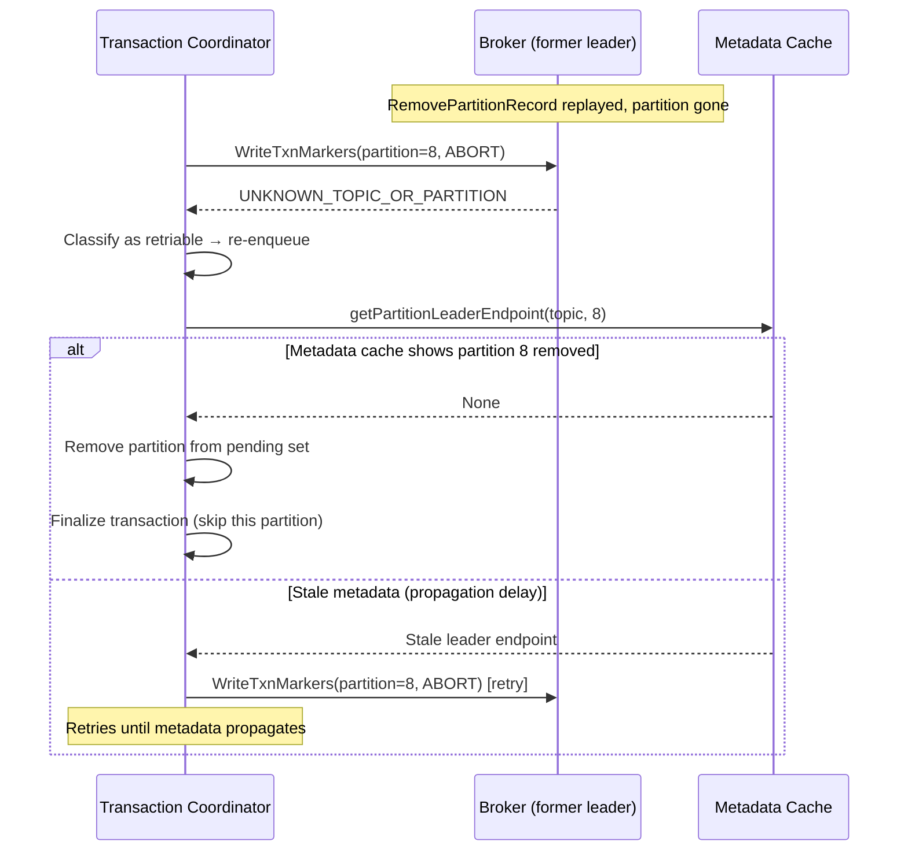

**Current behavior in `TransactionMarkerRequestCompletionHandler`:**
- `UNKNOWN_TOPIC_OR_PARTITION` is classified as **retriable** (no retry limit, no backoff)
- The escape hatch: when `metadataCache.getPartitionLeaderEndpoint()` returns `None`, the partition is
  removed from the transaction's pending set and the transaction proceeds to finalize

**Correctness for DeletePartitions:**
- The escape hatch works at partition granularity: when a specific partition is removed from the metadata image,
  `getPartitionLeaderEndpoint(topic, partitionId)` returns `None` even though the topic still exists
- Verification: `MetadataCache.getPartitionLeaderEndpoint()` queries `metadataSnapshot.partitions(topicName)`
  which is keyed by partition ID. A removed partition simply won't have an entry. ✓
- **Convergence window:** Between `RemovePartitionRecord` replay on the coordinator's broker and the metadata
  cache update, the coordinator retries. This window is typically < 1s (metadata propagates via Raft log).
- **No data loss, no stuck transactions.** The coordinator will always converge.

**Design decision: No new error code needed.**

`UNKNOWN_TOPIC_OR_PARTITION` is semantically correct (the partition is gone). The existing retry + metadata
check loop terminates correctly for individual partition removal. Introducing a non-retriable
`PARTITION_DELETED` error was considered but rejected:
- It would require modifying `WriteTxnMarkers` response handling across all existing coordinator versions
- The existing mechanism already terminates within the metadata propagation window (~100ms–1s)
- The benefit (faster convergence by ~100ms) does not justify the protocol change

#### 2PC Late Marker After Removal (Race Condition)

**Scenario:** Controller writes `RemovePartitionRecord`. A late `WriteTxnMarkers(COMMIT)` arrives at the broker
for the now-removed partition.

**Behavior:**
1. Broker calls `replicaManager.onlinePartition(partition)` → returns `None` (partition not in `allPartitions`)
2. Returns `UNKNOWN_TOPIC_OR_PARTITION` in the response
3. Transaction coordinator retries → metadata cache shows partition gone → drops from pending set
4. Transaction finalizes without the marker on the removed partition

**Why this is safe:**
- The partition's data is being deleted — the marker has no consumer-visible effect
- The transaction's state in `__transaction_state` will record COMMIT/ABORT regardless
- No divergence between coordinator state and partition log because the partition log ceases to exist

**Comparison to Cluster Mirroring KIP's 2PC concern:**
Unlike Cluster Mirroring where a COMMIT marker might arrive AFTER an ABORT was already written (creating
conflicting markers), DeletePartitions has a simpler model: once the partition is removed, NO marker can be
written. The transaction coordinator simply skips the partition. There is no risk of dual COMMIT+ABORT markers.

---

### Interaction with Idempotent Producers

**ProducerState cleanup:**

- `ProducerStateManager` is per-partition. When the partition is removed and its log segments are deleted, the
  producer state (`.snapshot` files) are deleted as part of `LogManager.asyncDelete()`.
- No cross-partition impact.
- If the same producer later writes to a different partition (after rerouting), it gets a fresh sequence number
  window on that partition. The broker tracks producer state independently per partition.

**Two-phase cleanup mechanism (existing `LogManager.asyncDelete()`):**

1. Phase 1 (immediate): Directory renamed from `topic-8` to `topic-8.<uuid>-delete`.
   `ProducerStateManager.updateParentDir()` updates internal path references. Snapshots NOT deleted yet.
2. Phase 2 (deferred, after `file.delete.delay.ms`): `UnifiedLog.delete()` calls
   `deleteProducerSnapshots(deletedSegments, false)` which renames `.snapshot` → `.snapshot.deleted`,
   then physically deletes. `LocalLog.deleteEmptyDir()` does recursive `Utils.delete(dir)` as safety net.

**Partition ID reuse safety (DeletePartitions + later CreatePartitions):**

When partition 8 is deleted and later a new partition 8 is created on the same topic:

```
Safety guarantees:
1. logCreationOrDeletionLock: Both asyncDelete() and createLog() synchronize on this lock.
   Old "topic-8" is renamed to "topic-8.<uuid>-delete" BEFORE new "topic-8" can be created.
2. Fresh empty directory: Files.createDirectories() creates brand new "topic-8" dir.
   ProducerStateManager scans it → zero snapshots → fresh state.
3. Restart protection: Directories with "-delete" suffix are recognized as pending-deletion
   on broker restart, never confused with active partitions.
4. Topic UUID unchanged: Unlike topic deletion + recreation, DeletePartitions keeps the same
   topic UUID. However, safety is still guaranteed by the directory rename + lock ordering.
   The ProducerStateManager for the new partition 8 starts completely clean.
```

**Invariant:** A new partition with a reused ID NEVER sees stale producer state from the old partition.
The `logCreationOrDeletionLock` serializes the rename-then-create sequence on each broker.

---

### Interaction with Share Groups (KIP-932)

Share groups maintain per-partition delivery state (`PersisterStateBatch` with offset ranges and delivery counts)
tracked by the `ShareCoordinatorShard`.

**When a partition enters DRAINING:**

- Share group members can still acknowledge messages (delivery completions)
- New message delivery stops (no new produce)
- Share coordinator continues tracking state for in-flight deliveries

**When a partition is REMOVED:**

**Gap identified:** The existing `ShareCoordinatorService.handleTopicsDeletion()` only cleans up state when
an *entire topic* is deleted (via `TopicsDelta.deletedTopicIds()`). It does NOT handle individual partition
removal within a still-existing topic.

**Required implementation:**

```java
// In ShareCoordinatorService — new method:
private void handlePartitionsDeleted(Uuid topicId, Set<Integer> removedPartitionIds) {
    runtime.scheduleWriteAllOperation(
        "on-partitions-deleted",
        coordinator -> coordinator.maybeCleanupShareStateForPartitions(topicId, removedPartitionIds)
    );
}

// In ShareCoordinatorShard — new method:
public CoordinatorResult<Void, CoordinatorRecord> maybeCleanupShareStateForPartitions(
        Uuid topicId, Set<Integer> removedPartitionIds) {
    Set<SharePartitionKey> eligibleKeys = new HashSet<>();
    shareStateMap.forEach((key, __) -> {
        if (key.topicId().equals(topicId) && removedPartitionIds.contains(key.partition())) {
            eligibleKeys.add(key);
        }
    });
    return new CoordinatorResult<>(eligibleKeys.stream()
        .map(key -> ShareCoordinatorRecordHelpers.newShareStateTombstoneRecord(
            key.groupId(), key.topicId(), key.partition()))
        .toList());
}
```

**Trigger:** In `ShareCoordinatorService.onNewMetadataImage()`, after checking `deletedTopicIds`, also
check `TopicsDelta` for topics with removed partitions (signaled by `RemovePartitionRecord` replay
removing entries from `TopicImage.partitions()`).

**In-flight delivery behavior:**
- Share group members with acquired (in-flight) records from the removed partition will receive
  `UNKNOWN_TOPIC_OR_PARTITION` on their next `ShareAcknowledge` call
- The share coordinator writes tombstones for the partition's state entries in `__share_group_state`
- Unacknowledged deliveries are effectively abandoned (no retry possible — partition is gone)
- This is acceptable: the data is being deleted anyway

**Same pattern as `OffsetMetadataManager.onPartitionsDeleted()` for consumer offsets.**

---

### Interaction with Kafka Streams

**When a partition enters DRAINING:**

- Streams applications subscribed to the topic continue consuming from the draining partition
- Tasks assigned to the draining partition continue processing

**When a partition is REMOVED:**

- Metadata update triggers consumer group rebalance
- `StreamsPartitionAssignor` recalculates task assignments with fewer partitions
- `StreamsRebalanceListener.onPartitionsRevoked()` is called
- `TaskManager.handleRevocation()` commits state and closes tasks for removed partitions
- State stores associated with removed partition tasks are cleaned up

**Repartition topics:**

- If the draining topic is an internal repartition topic → **Reject with INVALID_REQUEST.** Internal Streams topics
  should not have partitions deleted (they are managed by the Streams app). Detection: check if topic name matches
  the Streams internal topic naming pattern or if Topic.isInternal() returns true.
- Actually, internal Streams topics are not in `Topic.INTERNAL_TOPICS`; they use app-id prefixed names. The
  protection here is the same as any user topic — the operator must know what they are doing.

**Key consideration for Streams operators:**

- If Streams uses `hash(key) % partitionCount` for routing to a repartition topic, and that topic has partitions
  deleted, the repartition data becomes inconsistent. Operators must ensure no active Streams app is using the topic
  before deleting partitions, or perform a full application restart + state cleanup.

**Changelog/Repartition topic partition count mismatch:**

When a source topic has partitions deleted, any derived changelog or repartition topic retains its original
partition count. This creates a mismatch:

```
Before: source-topic (10 partitions) → changelog-topic (10 partitions)
After:  source-topic (7 partitions) → changelog-topic (10 partitions, 3 now orphaned)

StreamThread tasks:
  - Tasks 0-6: source partition matches changelog partition ✓
  - Tasks 7-9: no source partition, but changelog partition still exists
              → StreamsPartitionAssignor won't assign these tasks (no input partition)
              → Changelog partitions 7-9 become orphaned state stores
```

**No automatic detection mechanism exists.** The `StreamsPartitionAssignor` computes tasks from source topic
partition count. If the source shrinks, tasks for the deleted partitions are simply never assigned. The
changelog data remains on disk but is never accessed.

**Operator action required:**
1. Stop all Streams application instances
2. Delete partitions from the source topic
3. Reset the application (`kafka-streams-application-reset.sh --input-topics ...`)
4. The application will recreate internal topics with correct partition count on restart
5. State stores will be rebuilt from changelog

**Alternative (avoid mismatch):** Delete the internal topics manually before restarting the Streams app.
The app will recreate them with the correct partition count based on the source topic.

---

### Interaction with Kafka Connect / MirrorMaker 2

#### Sink Connectors

- Sink connectors assigned to draining partitions continue consuming until removal
- On removal: connector rebalance triggered, tasks reassigned to remaining partitions
- No special handling needed

#### Source Connectors

- Source connectors write to topics. If the target topic has draining partitions, the connector's produce calls
  will be routed away from draining partitions (normal producer behavior)
- No special handling needed

#### MirrorMaker 2

- MM2's `MirrorSourceConnector.refreshTopicPartitions()` already detects "deleted partitions" by comparing current
  source partitions against known partitions
- MM2 does NOT propagate partition deletion to the target cluster — it only increases partition count, never decreases
- If source topic shrinks, MM2 will detect deleted source partitions and stop replicating them, but target topic
  keeps its original partition count
- **Operators must separately delete partitions on the target topic** if they want symmetric shrinking

---

### Interaction with Remote/Tiered Storage

If the topic has `remote.log.storage.enable=true`:

**During DRAINING:**

- Remote log manager continues operating normally
- Tier uploads continue for any new data (but no new data arrives since produce is rejected)
- Remote fetches continue to be served

**On REMOVAL:**

- `RemoteLogManager.stopPartitions()` called with `deleteRemoteLog=true`
- This schedules async deletion of all remote log segments for the partition
- `RemoteLogMetadataManager.onStopPartitions()` cleans up remote metadata
- This reuses the exact same code path as topic deletion

**Important:** Remote segment deletion is async and may take time. The partition is considered removed from the
metadata perspective immediately; remote cleanup happens in the background.

#### Diskless Topics (KIP-1500)

Diskless topics store data exclusively in tiered storage with no local log segments on brokers. At the time
of writing, the Diskless Topics design is still under discussion.

**Impact on DeletePartitions:**

- `LogManager.asyncDelete()` operates on local log directories. For diskless partitions, there is no local
  directory to rename or delete.
- Remote segment deletion via `RemoteLogManager.stopPartitions()` would still apply.
- The metadata removal (`RemovePartitionRecord`) works identically regardless of storage location.

**Design decision:** Diskless topics are **not explicitly supported** in the initial implementation. If a
partition has no local log (fully diskless), `asyncDelete()` will be a no-op (no directory to rename).
Remote cleanup proceeds normally. A future KIP for Diskless Topics will address any additional cleanup
requirements.

---

### Interaction with Partition-Level Metrics

When a partition is removed:

1. **BrokerTopicMetrics**: `GaugeWrapper.removeKey(partitionNum)` removes the partition's contribution to
   topic-level aggregate metrics
2. **DelayedProduce metrics**: `removePartitionMetrics(topicPartition)` removes expiration rate meter
3. **Replica-level metrics**: cleaned up when `Partition` object is closed
4. **Remote storage metrics**: `RemoteCopyLagBytes`/`RemoteCopyLagSegments` gauges removed for this partition

No draining-specific metrics are introduced in the MVP. Observability of draining state is through
`DescribeTopicPartitions` response.

---

### Interaction with Internal Topics

The following topics are protected from `DeletePartitions`:

| Topic                 | Reason                                                                                          |
|-----------------------|-------------------------------------------------------------------------------------------------|
| `__consumer_offsets`  | Removing partitions would lose committed offsets for consumer groups hashed to those partitions |
| `__transaction_state` | Removing partitions would orphan active transactions                                            |
| `__share_group_state` | Removing partitions would lose share group delivery state                                       |
| `__cluster_metadata`  | KRaft metadata topic; catastrophic to modify                                                    |

**Detection:** `Topic.isInternal(topicName)` check in validation step. Returns `INVALID_REQUEST` (42) with message
"Cannot delete partitions from internal topic '{name}'."

---

### Interaction with ACLs

- `DeletePartitions` requires `ALTER` permission on the topic (same as `CreatePartitions`)
- ACLs are topic-level only (no partition-level ACL granularity exists in Kafka)
- No ACL changes needed
- The `ALTER` operation is appropriate because we are altering the topic's partition configuration

---

### Interaction with Quotas

#### Controller Mutation Quota

`DeletePartitions` consumes controller mutation quota proportional to `deleteCount`:

```java
context.applyPartitionChangeQuota(deleteCount);
```

If the mutation quota is exhausted, the controller returns `THROTTLING_QUOTA_EXCEEDED` (89) with a `ThrottleTimeMs`
value indicating when to retry.

#### Produce/Fetch Quotas

No impact. Produce quotas are per-client, not per-partition. When partitions are removed, the client's traffic
redistributes to remaining partitions under the same quota.

---

### CLI Support

File: `tools/src/main/java/org/apache/kafka/tools/TopicCommand.java`

Add `--delete-partitions <count>` option to `kafka-topics.sh --alter`:

```
kafka-topics.sh --bootstrap-server localhost:9092 \
    --alter --topic my-topic \
    --delete-partitions 3
```

This removes the last 3 partitions from `my-topic`, placing them in draining state.

**Validation in CLI:**

- `--delete-partitions` and `--partitions` (increase) are mutually exclusive
- `--delete-partitions` requires a positive integer

---

## Edge Cases and Invariants

### Partition Numbering After Delete + CreatePartitions

**Example:** Topic with partitions [0..9], delete 3 → partitions [0..6]. Then `CreatePartitions(count=9)` →
partitions [0..8].

**Invariant:** Partition IDs ALWAYS form a contiguous range `[0, count-1]`. IDs are reused after deletion.

**Justification:**

- After `RemovePartitionRecord` is replayed, the partition ceases to exist in `TopicImage`
- `CreatePartitions` adds new partitions starting from the current count (which is now 7), so new partitions get
  IDs 7 and 8
- The `PartitionRecord` written for new partition 7 creates a fresh partition with empty log — there is no
  confusion with the old partition 7's data (which was fully deleted)
- Consumer committed offsets for old partition 7 were cleaned up via tombstones (see Orphaned Offsets section)
- `hash(key) % 9` with new count is entirely new routing; no expectations from old routing carry over

### CreatePartitions During Draining

**Blocked** with `PARTITION_OPERATION_IN_PROGRESS` (136).

**Why not allow it?**

- If topic has partitions 0-9 and partitions 7-9 are draining, what does `CreatePartitions(count=12)` mean?
    - Should new partitions be 10, 11? But the topic currently reports 7 active partitions.
    - Should new partitions be 7, 8? But 7-9 still exist in draining state.
- The semantics are ambiguous and the workaround is simple: wait for drain to complete, then create.

### DeletePartitions During Existing Drain

**Blocked** with `PARTITION_OPERATION_IN_PROGRESS` (136).

Only one drain operation per topic at a time. Operator must wait for current drain to complete.

### Topic Deletion During Draining

**Allowed.** `DeleteTopics` takes priority and is a superset of partition deletion.

When `RemoveTopicRecord` is replayed:

- All draining state for that topic is implicitly discarded
- The deferred removal event becomes a no-op (topic no longer exists when it fires)
- Implementation: deferred event checks if topic still exists before writing `RemovePartitionRecord`

### Controller Failover During Draining

**Guaranteed recovery.** The `PartitionDrainingRecord` is persisted in the metadata log. New controller:

1. Replays all metadata records
2. Rebuilds draining state in `TopicImage`
3. On first tick: checks all draining sets against current wall-clock
4. Deadline passed → immediately writes `RemovePartitionRecord` (with small delay for log catch-up)
5. Deadline in future → checks again on next tick

### Broker Restart During Draining

- Broker replays metadata on startup
- Sees `PartitionDrainingRecord` → marks local partition as draining
- Resumes serving fetch requests for the partition
- Rejects produce requests
- If `RemovePartitionRecord` was written while broker was down → catches up and deletes local log

### Split-Brain / Stale Controller

Not possible in KRaft. Only the active controller (Raft leader) can write to the metadata log. A stale controller
cannot write `PartitionDrainingRecord` or `RemovePartitionRecord`.

### deleteCount Equals currentPartitionCount - 1 (Only 1 Partition Remains)

**Allowed.** A topic with 1 partition is valid. All keys hash to partition 0.

### partition.drain.timeout.ms = 0

**Allowed.** Means immediate removal with no drain period. The controller writes `PartitionDrainingRecord` and
immediately follows with `RemovePartitionRecord` in the same batch (or next tick). This is useful for operators
who have already drained consumers manually.

### Concurrent Requests for Different Topics

**Allowed.** Each topic's draining state is independent. Concurrent `DeletePartitions` for different topics
proceed in parallel.

### Network Partition Between Controller and Brokers

- If a broker cannot communicate with the controller, it won't receive the metadata update about draining
- The broker continues serving produce requests to the partition until it catches up
- Eventually (when network heals), broker gets the update and starts rejecting produces
- This is the same eventual-consistency model as all Kafka metadata propagation

### What If Producer Ignores NOT_LEADER_OR_FOLLOWER?

A misbehaving producer that doesn't refresh metadata will keep getting `NOT_LEADER_OR_FOLLOWER` on every attempt.
It cannot write to a draining partition. The broker-side enforcement is authoritative regardless of client behavior.

### Replica on JBOD Disk Failure During Draining

```
Partition 8: replicas=[B0*, B1, B2], directories=[d0, d1, d2], state=DRAINING
B1's disk d1 fails (JBOD, not full broker failure).

  1. B1 reports log dir failure via BrokerHeartbeat
  2. Controller removes B1 from ISR for partition 8
  3. Partition 8 continues on [B0*, B2] — ISR=[B0, B2]
  4. Consumer unaffected (leader B0 alive)
  5. Draining continues normally
```

If `d0` (leader's disk) fails:

- Same as "leader crashes" scenario — controller elects from remaining ISR
- If B0 has other disks and partition is on the failed disk, it's functionally equivalent to B0 losing
  that partition replica

### Retention Policy During Draining

**Problem:** If `retention.ms` is short (e.g., 5 minutes) and `partition.drain.timeout.ms` is long (e.g., 1 hour),
retention will delete data from the draining partition BEFORE consumers can drain it.

```
Example:
  Topic config: retention.ms=300000 (5 min), partition.drain.timeout.ms=3600000 (1 hour)
  Partition 8 enters DRAINING at T0. Last message written at T0.
  T0 + 5min: retention.ms expires → LogManager deletes oldest segments
  T0 + 10min: consumer starts draining → data already gone!
```

**Design decision: Retention continues to run during draining.**

Rationale:
- Pausing retention would require partition-level retention override — complex to implement
- If retention deletes data before consumers drain, the consumers simply reach end-of-log faster
- This is an operator responsibility: set `partition.drain.timeout.ms` shorter than or comparable to
  `retention.ms`, OR increase retention before initiating deletion
- Consistent behavior: `retention.ms` is always enforced regardless of partition state

**Documentation warning:** The AdminClient Javadoc and CLI output must warn:
> "Ensure partition.drain.timeout.ms does not exceed retention.ms for time-based retention topics,
> otherwise data may be deleted by retention before consumers can drain it."

### Log Compaction and Data Loss Semantics

For topics with `cleanup.policy=compact`:

**Unique key loss:** If partition 8 holds the ONLY remaining copy of key "X" (after compaction removed
older versions on other partitions, or the key was only ever written to partition 8), deleting partition 8
permanently loses key "X" with no recovery path.

This is **fundamentally identical** to deleting a whole topic — both are destructive operations that lose
data. The difference is that partition deletion is more surgical, affecting only keys routed to the
deleted partitions.

**Operator responsibility:**
- Before deleting partitions from a compacted topic, operators must understand that any key whose
  ONLY remaining record is in a deleted partition will be permanently lost
- If the topic uses a key-based partitioner (`hash(key) % partitionCount`), operators can determine
  exactly which keys are affected: those where `hash(key) % oldCount` maps to a deleted partition
- For topics where all keys must be preserved, operators should re-produce affected keys to remaining
  partitions before initiating deletion

**No system-level protection:** The system does NOT scan partition data to warn about unique keys.
This is analogous to how `DeleteTopics` does not warn about data loss — it is always an operator decision.

### Log Cleaner and Draining Partitions

For log-compacted partitions in DRAINING state:

- Log cleaner **continues to run** — compaction keeps the log small
- Since no new data arrives, cleaner work eventually stops naturally (nothing new to compact)
- On removal: `LogManager.asyncDelete()` calls `cleaner.abortCleaning(topicPartition)` to stop any
  in-progress compaction before renaming the directory

### Fetch Session Cache and Draining Partitions

Consumers using incremental fetch (fetch sessions) have a server-side session cache tracking which partitions
they are fetching.

During DRAINING:

- Fetch session continues normally — consumer's fetched partitions include the draining partition
- Server continues serving data from the draining partition

On REMOVAL:

- Next incremental fetch from client will reference a partition that no longer exists
- Server returns `UNKNOWN_TOPIC_OR_PARTITION` for that partition in the fetch response
- Client removes partition from fetch session and triggers metadata refresh
- Consistent with existing behavior when a topic is deleted mid-fetch-session

**Important:** The broker does NOT proactively invalidate fetch sessions when partitions are removed. The
mechanism is entirely passive — errors propagate on the next client request. If the client dies without
cleanup, the stale session entry lingers until evicted by cache pressure (minimum 120s idle). This is
acceptable: no correctness impact, just memory.

### Consumer Group Static Membership (KIP-345) and Partition Removal

Static members (`group.instance.id` set) normally hold their partitions through the `session.timeout.ms`
window even after stopping heartbeats — this prevents unnecessary rebalances during rolling restarts.

**Partition removal triggers immediate rebalance regardless of static membership:**

| Trigger | Behavior for Static Members |
|---------|---------------------------|
| Member failed/left (no heartbeat) | Session timeout respected — partitions held |
| Metadata changed (partition removed) | **Immediate rebalance** — session timeout irrelevant |

**Classic protocol path:** Consumer leader detects partition count change via `MetadataSnapshot` comparison →
sends JoinGroup → forces rebalance on coordinator.

**New protocol (KIP-848) path:** `GroupMetadataManager.onMetadataUpdate()` calls
`group.requestMetadataRefresh()` → resets metadata deadline to 0 → next heartbeat from ANY member triggers
group epoch bump → new assignment computed immediately.

**Conclusion:** No special handling needed for static membership. Partition removal is a metadata change,
not a member failure, so it bypasses the session timeout grace period.

### TOCTOU Safety: Concurrent Operations on Controller

A potential concern: can a partition reassignment START between the time `DeletePartitions` checks
`isReassigning()` and the time it writes `PartitionDrainingRecord`?

**Answer: No. Not possible.**

The KRaft controller is explicitly single-threaded (all operations run on `KafkaEventQueue`'s single
event handler thread via `ControllerWriteEvent`). The validation check and record generation happen in
a single `generateRecordsAndResult()` invocation. No interleaving is possible.

This also means:
- `DeletePartitions` cannot race with `AlterPartitionReassignments` (serialized)
- `DeletePartitions` cannot race with `CreatePartitions` (serialized)
- `DeletePartitions` cannot race with `DeleteTopics` (serialized)
- Controller failover serializes via Raft leader election (only one active controller)

### Delayed ACK (acks=all) In-Flight When Draining Starts

```
Timeline:
  T0: Producer sends Produce(partition=8, acks=all)
  T1: Leader appends locally, waiting for ISR followers to replicate
  T2: PartitionDrainingRecord arrives at broker (metadata update)
  T3: Followers replicate → ISR ack achieved

  Result: The produce request SUCCEEDS (T3 > T2 but it was already in-flight)
```

**Design decision:** In-flight produce requests that were already appended to the leader's log before
the draining state arrives are NOT retroactively rejected.

Rationale:

- The data is already in the leader's log; rejecting the client response doesn't remove the data
- Simplifies implementation — no need to scan pending delayed operations when draining starts
- After this in-flight request completes, subsequent produce requests will be rejected

**BUT:** New produce requests that arrive AFTER the broker learns about draining ARE rejected, even
if the leader hasn't processed the metadata update atomically:

```java
// Check order in appendRecords:
// 1. Is partition draining? → reject
// 2. Append to log
// 3. Wait for ISR ack (DelayedProduce)
```

### AlterConfigs on partition.drain.timeout.ms During Draining

**Allowed, but no effect on in-progress drain.**

The config value is read only at the time `DeletePartitionsRequest` is processed. The deadline is computed
as an absolute timestamp and stored in `PartitionDrainingRecord`. Changing the config after draining starts
only affects future `DeletePartitions` requests.

If operators need to extend a drain: not supported in MVP (requires Cancel + Re-issue, which is future work).

### Multiple Broker Failures During Removal (Cleanup Reliability)

```
RemovePartitionRecord written. Brokers B0, B1, B2 hold replicas.
B1 and B2 are offline during removal.

  B0: receives record → cleans up immediately
  B1: offline → will clean up on recovery
  B2: offline → will clean up on recovery

What if B1 recovers but crashes again before cleanup completes?
  → On next recovery, same logic applies: detect stale dir, async delete
  → Cleanup is idempotent — partial rename (to .delete suffix) is re-detected
  → LogManager startup scans for ".delete" suffixed directories and re-queues them
```

The cleanup process is crash-safe because:

1. `asyncDelete()` renames first (atomic on most filesystems), then queues for background deletion
2. On startup, `LogManager.loadLogs()` scans for `.delete`-suffixed directories and re-queues them
3. Even if a broker crashes mid-deletion, the next startup will finish the job

---

## Metrics

### New JMX Metrics

| Name | Type | MBean | Description |
|------|------|-------|-------------|
| `DrainingPartitionCount` | Gauge | `kafka.controller:type=KafkaController,name=DrainingPartitionCount` | Number of partitions currently in DRAINING state across all topics. Only reported by the active controller. |
| `PendingDrainRemovals` | Gauge | `kafka.controller:type=KafkaController,name=PendingDrainRemovals` | Number of scheduled deferred removal events pending in the DrainScheduler. |
| `DrainCompletedTotal` | Meter | `kafka.controller:type=KafkaController,name=DrainCompletedTotal` | Cumulative count of partitions that transitioned from DRAINING to REMOVED. |
| `DeletePartitionsRequestsPerSec` | Meter | `kafka.network:type=RequestMetrics,name=RequestsPerSec,request=DeletePartitions` | Rate of DeletePartitions requests received by the broker. |
| `DeletePartitionsTotalTimeMs` | Histogram | `kafka.network:type=RequestMetrics,name=TotalTimeMs,request=DeletePartitions` | Total time to process DeletePartitions requests. |
| `DeletePartitionsErrorsPerSec` | Meter | `kafka.network:type=RequestMetrics,name=ErrorsPerSec,request=DeletePartitions,error={errorName}` | Rate of errors returned by DeletePartitions requests, broken down by error code. |

### Existing Metrics Behavior During Draining

| Metric | During DRAINING | After REMOVAL |
|--------|----------------|---------------|
| `kafka.server:type=BrokerTopicMetrics,name=MessagesInPerSec,topic=X` | Drops to 0 for draining partitions (no writes) | Partition contribution removed |
| `kafka.server:type=BrokerTopicMetrics,name=BytesOutPerSec,topic=X` | Consumer reads continue; may remain non-zero | Partition contribution removed |
| `kafka.server:type=ReplicaManager,name=PartitionCount` | Unchanged (partition still exists) | Decremented |
| `kafka.server:type=ReplicaManager,name=UnderReplicatedPartitions` | May include draining partitions if ISR < replicas | Partition removed from count |
| `kafka.server:type=FetcherLagMetrics,name=ConsumerLag,topic=X,partition=N` | Continues reporting consumer lag | Metric deregistered |

---

## Performance Considerations

### Controller Impact

- **PartitionDrainingRecord write**: Single metadata record per `DeletePartitions` call, comparable to a `PartitionChangeRecord`. Negligible impact on Raft append latency.
- **RemovePartitionRecord writes**: One record per partition removed. For a topic with 100 partitions deleting 50, this is 50 records in a batch — similar to a 50-partition topic deletion. Batch amortizes Raft commit overhead.
- **ScheduledExecutorService memory**: Each pending drain holds one `ScheduledFuture<?>` reference (~64 bytes). Even 10,000 concurrent drains require < 1 MB.
- **Failover recovery**: On controller activation, iterating all topics with draining partitions is O(drainingTopics). In practice, very few topics drain simultaneously, so this adds negligible startup latency.

### Broker Impact

- **Produce rejection overhead**: A single boolean check (`partition.isDraining()`) on each produce request for draining partitions. The hot path (non-draining) adds one field read — effectively zero cost.
- **Metadata propagation**: Draining/removal records propagate via the existing metadata update path. No additional network round trips required.
- **Log deletion**: `asyncDelete()` renames the directory (O(1) filesystem operation) then queues background deletion. Background thread deletes segment files sequentially. Deleting a 100 GB partition log takes proportional time but does not block serving.
- **Remote storage deletion**: Async, fire-and-forget with retries. Does not block broker serving or replication.
- **Checkpoint file rewrites**: One atomic file write per log directory to update offset checkpoint files. Existing code path, same as topic deletion.

### Client Impact

- **Producer**: One metadata refresh RTT (~2-10ms in same DC) per draining event. After refresh, routing stabilizes. No throughput impact on non-draining partitions.
- **Consumer**: Zero impact during draining (fetch continues normally). On removal, one rebalance (~seconds depending on group size). Standard rebalance cost.
- **AdminClient**: `deletePartitions()` is a single controller round-trip. Latency comparable to `createPartitions()`.

### Scalability Limits

| Dimension | Practical Limit | Bottleneck |
|-----------|----------------|------------|
| Concurrent draining topics | ~10,000 | ScheduledExecutorService queue size (unbounded, but controller memory) |
| Partitions per single DeletePartitions call | ~10,000 | Metadata batch size (default 5MB); each PartitionDrainingRecord is ~50 bytes |
| Drain timeout range | 0 to ~292 years (int64 ms) | Wall-clock overflow not a concern in practice |
| Removal batch size | Limited by controller batch size | Same constraint as topic deletion |

---

## Command-Line Interface

### Usage Examples

**Delete the last 3 partitions from a topic (enters draining state):**

```bash
$ bin/kafka-topics.sh --bootstrap-server localhost:9092 \
    --alter --topic orders \
    --delete-partitions 3
Initiated partition deletion for topic 'orders': partitions [7, 8, 9] entering DRAINING state.
Drain deadline: 2026-07-15T15:00:00Z (partition.drain.timeout.ms=3600000)
```

**Check draining status via describe:**

```bash
$ bin/kafka-topics.sh --bootstrap-server localhost:9092 \
    --describe --topic orders
Topic: orders   TopicId: abc123   PartitionCount: 10   ReplicationFactor: 3
  Partition: 0   Leader: 1   Replicas: 1,2,3   Isr: 1,2,3
  ...
  Partition: 7   Leader: 2   Replicas: 2,3,1   Isr: 2,3,1   Draining: true   Deadline: 2026-07-15T15:00:00Z
  Partition: 8   Leader: 3   Replicas: 3,1,2   Isr: 3,1,2   Draining: true   Deadline: 2026-07-15T15:00:00Z
  Partition: 9   Leader: 1   Replicas: 1,2,3   Isr: 1,2,3   Draining: true   Deadline: 2026-07-15T15:00:00Z
```

**Set drain timeout before deletion (immediate removal):**

```bash
$ bin/kafka-configs.sh --bootstrap-server localhost:9092 \
    --entity-type topics --entity-name orders \
    --alter --add-config partition.drain.timeout.ms=0
Completed updating config for topic orders.

$ bin/kafka-topics.sh --bootstrap-server localhost:9092 \
    --alter --topic orders \
    --delete-partitions 3
Initiated partition deletion for topic 'orders': partitions [7, 8, 9] removed immediately (drain timeout = 0).
```

**Error: draining already in progress:**

```bash
$ bin/kafka-topics.sh --bootstrap-server localhost:9092 \
    --alter --topic orders \
    --delete-partitions 2
Error while executing topic command: A partition operation is already in progress for topic 'orders'.
```

**Error: invalid count:**

```bash
$ bin/kafka-topics.sh --bootstrap-server localhost:9092 \
    --alter --topic orders \
    --delete-partitions 10
Error while executing topic command: The requested delete partition count is invalid.
Cannot delete all partitions; at least one partition must remain.
```

### CLI Options Reference

| Option | Description | Mutually Exclusive With |
|--------|-------------|------------------------|
| `--delete-partitions <count>` | Number of partitions to remove from the tail | `--partitions` (increase) |

---

## Compatibility, Deprecation, and Migration Plan

### Compatibility Matrix

| Component | Version Requirement | Notes |
|-----------|-------------------|-------|
| Controller | IBP_4_4_IV2+ | Must support PartitionDrainingRecord, RemovePartitionRecord |
| Brokers | IBP_4_4_IV2+ | Must support draining state in metadata image |
| Admin Client (caller) | 4.4+ | Must support DeletePartitions API key 94 |
| Producers | Any version | No code changes. v0-v13 metadata: draining partitions excluded. v14: IsDraining field. |
| Consumers (group) | Any version | No code changes. Standard rebalance handles removal. |
| Consumers (manual assign) | Any version | Application must detect UNKNOWN_TOPIC_OR_PARTITION and update assignment. |
| Kafka Streams | Any version | Rebalance handles task reassignment automatically. |
| Kafka Connect | Any version | Connector rebalance handles removal automatically. |
| MirrorMaker 2 | Any version | Detects partition deletion on source. Does NOT propagate to target. |

### Wire Protocol Compatibility

| Client version                         | Behavior                                                                                                               |
|----------------------------------------|------------------------------------------------------------------------------------------------------------------------|
| Old client, old API version            | Cannot call DeletePartitions (unknown API key → `UnsupportedVersionException`)                                         |
| Old producer (MetadataResponse v0-v13) | Draining partitions excluded from metadata. Producer sees reduced count. No code changes needed.                       |
| Old consumer                           | Continues consuming from draining partitions. On removal, metadata refresh triggers rebalance. No code changes needed. |
| New client (v14 metadata)              | Sees `IsDraining=true` field. Can provide observability.                                                               |

### Cluster Upgrade Path

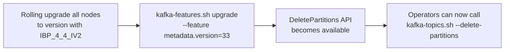

1. Rolling upgrade all brokers/controllers to version supporting IBP_4_4_IV2
2. Set `MetadataVersion` to IBP_4_4_IV2 via `kafka-features.sh`
3. DeletePartitions API becomes available

### Rollback

If issues are found after enabling:

- Partitions already REMOVED cannot be recovered (data is deleted)
- Partitions in DRAINING can be "unblocked" by downgrading MetadataVersion, but the draining records remain in the
  log. On downgrade, the new controller ignores unknown record types (standard KRaft behavior for forward
  compatibility)
- **Recommendation:** Test thoroughly with non-critical topics first

### Release Phases

| Phase | MetadataVersion | Stability | Enablement |
|-------|----------------|-----------|------------|
| Early Access | IBP_4_4_IV2 (unstable) | `unstable.feature.versions.enable=true` required | Explicit opt-in. Not for production. |
| General Availability | Future IBP (stable) | Stable, no flags needed | Enabled by default at target MetadataVersion. |

---

## Files Modified (Complete List)

### New Files

| File                                                                                              | Description            |
|---------------------------------------------------------------------------------------------------|------------------------|
| `clients/src/main/resources/common/message/DeletePartitionsRequest.json`                          | API schema             |
| `clients/src/main/resources/common/message/DeletePartitionsResponse.json`                         | API schema             |
| `metadata/src/main/resources/common/metadata/PartitionDrainingRecord.json`                        | Metadata record schema |
| `metadata/src/main/resources/common/metadata/RemovePartitionRecord.json`                          | Metadata record schema |
| `clients/src/main/java/org/apache/kafka/common/errors/PartitionOperationInProgressException.java` | Exception              |
| `clients/src/main/java/org/apache/kafka/common/errors/InvalidDeletePartitionCountException.java`  | Exception              |
| `clients/src/main/java/org/apache/kafka/clients/admin/DeletePartitionsCount.java`                 | AdminClient DTO        |
| `clients/src/main/java/org/apache/kafka/clients/admin/DeletePartitionsOptions.java`               | AdminClient options    |
| `clients/src/main/java/org/apache/kafka/clients/admin/DeletePartitionsResult.java`                | AdminClient result     |

### Modified Files

| File                                                                                            | Change                                                                     |
|-------------------------------------------------------------------------------------------------|----------------------------------------------------------------------------|
| `clients/src/main/resources/common/message/MetadataRequest.json`                                | validVersions "0-13" → "0-14"                                              |
| `clients/src/main/resources/common/message/MetadataResponse.json`                               | validVersions "0-13" → "0-14"; add `IsDraining` field to partition         |
| `clients/src/main/resources/common/message/DescribeTopicPartitionsRequest.json`                 | validVersions "0" → "0-1"                                                  |
| `clients/src/main/resources/common/message/DescribeTopicPartitionsResponse.json`                | validVersions "0" → "0-1"; add `IsDraining`, `DrainDeadlineMs`             |
| `clients/src/main/java/org/apache/kafka/common/protocol/Errors.java`                            | Add codes 136, 137                                                         |
| `clients/src/main/java/org/apache/kafka/common/config/TopicConfig.java`                         | Add `partition.drain.timeout.ms`                                           |
| `clients/src/main/java/org/apache/kafka/clients/admin/Admin.java`                               | Add `deletePartitions()` methods                                           |
| `clients/src/main/java/org/apache/kafka/clients/admin/KafkaAdminClient.java`                    | Implement `deletePartitions()`                                             |
| `server-common/src/main/java/org/apache/kafka/server/common/MetadataVersion.java`               | Add `IBP_4_4_IV2`, add `isDeletePartitionsSupported()`                     |
| `metadata/src/main/java/org/apache/kafka/metadata/PartitionRegistration.java`                   | Add `draining` boolean field + builder method                              |
| `metadata/src/main/java/org/apache/kafka/image/TopicImage.java`                                 | Add `hasDrainingPartitions()`, `activePartitionCount()` helpers            |
| `metadata/src/main/java/org/apache/kafka/image/TopicDelta.java`                                 | Add replay for `PartitionDrainingRecord`, `RemovePartitionRecord`          |
| `metadata/src/main/java/org/apache/kafka/image/MetadataDelta.java`                              | Add replay dispatch for new records                                        |
| `metadata/src/main/java/org/apache/kafka/controller/Controller.java`                            | Add `deletePartitions()` interface method                                  |
| `metadata/src/main/java/org/apache/kafka/controller/QuorumController.java`                      | Wire `deletePartitions()`, add deadline tick check                         |
| `metadata/src/main/java/org/apache/kafka/controller/ReplicationControlManager.java`             | Implement `deletePartitions()`, block `createPartitions()` during draining |
| `core/src/main/scala/kafka/server/ControllerApis.scala`                                         | Add `handleDeletePartitions()` request handler                             |
| `group-coordinator/src/main/java/org/apache/kafka/coordinator/group/OffsetMetadataManager.java` | Add `onPartitionsDeleted()` for offset tombstones                          |
| `tools/src/main/java/org/apache/kafka/tools/TopicCommand.java`                                  | Add `--delete-partitions` CLI option                                       |

---

## Testing Strategy

### Unit Tests

| Component                                       | Test Cases                                                                                                 |
|-------------------------------------------------|------------------------------------------------------------------------------------------------------------|
| `ReplicationControlManager`                     | All validation paths (invalid count, internal topic, unauthorized, reassignment conflict, duplicate drain) |
| `ReplicationControlManager`                     | State machine: ACTIVE→DRAINING on PartitionDrainingRecord write                                            |
| `ReplicationControlManager`                     | Deadline tick: writes RemovePartitionRecord when time exceeds deadline                                     |
| `ReplicationControlManager`                     | CreatePartitions blocked during draining                                                                   |
| `ReplicationControlManager`                     | AlterPartitionReassignments blocked for draining partitions                                                |
| `ReplicationControlManager`                     | DeletePartitions blocked during existing drain (same topic)                                                |
| `TopicDelta`                                    | Replay `PartitionDrainingRecord` → marks partitions as draining                                            |
| `TopicDelta`                                    | Replay `RemovePartitionRecord` → removes partition from map                                                |
| `MetadataDelta`                                 | Dispatch to TopicsDelta for both new record types                                                          |
| `PartitionRegistration`                         | Builder sets draining=true; equals/hashCode includes draining                                              |
| `TopicImage`                                    | `hasDrainingPartitions()` returns true/false correctly                                                     |
| `TopicImage`                                    | `activePartitionCount()` excludes draining partitions                                                      |
| `MetadataResponse` serialization                | v14 includes IsDraining field; v0-v13 excludes draining partitions                                         |
| `DescribeTopicPartitionsResponse` serialization | v1 includes IsDraining and DrainDeadlineMs                                                                 |
| `Errors`                                        | New error codes serialize/deserialize correctly                                                            |
| `TopicConfig`                                   | New config validates (type=long, atLeast(0))                                                               |
| `DeletePartitionsRequest/Response`              | Serde round-trip                                                                                           |

### Integration Tests

| Scenario                             | Verification                                                                                                                                   |
|--------------------------------------|------------------------------------------------------------------------------------------------------------------------------------------------|
| Happy path: full lifecycle           | DeletePartitions → drain period → timeout → RemovePartitionRecord → log cleanup verified                                                       |
| Producer during draining             | Produce to draining partition → NOT_LEADER_OR_FOLLOWER → metadata refresh → produce to active partition succeeds                               |
| Consumer during draining             | Consumer fetches from draining partition → data received → partition removed → rebalance → consumer assigned remaining partitions              |
| Transactional producer               | Open txn writing to partition → partition enters draining → data produce rejected → abort marker allowed through → transaction aborted cleanly |
| CreatePartitions blocked             | CreatePartitions during drain → PARTITION_OPERATION_IN_PROGRESS                                                                                |
| AlterPartitionReassignments blocked  | Reassign draining partition → PARTITION_OPERATION_IN_PROGRESS                                                                                  |
| DeletePartitions during reassignment | Partition being reassigned → DeletePartitions returns PARTITION_OPERATION_IN_PROGRESS                                                          |
| Topic deletion during drain          | DeleteTopics → drain cancelled implicitly → topic removed                                                                                      |
| Multiple topics concurrently         | DeletePartitions on 3 different topics simultaneously → all succeed independently                                                              |
| Consumer group offset cleanup        | After partition removed → verify offsets tombstoned in __consumer_offsets                                                                      |
| Partition reuse after delete         | Delete 3 → CreatePartitions +3 → new partitions get reused IDs, fresh logs                                                                     |
| CLI: --delete-partitions             | kafka-topics.sh --alter --delete-partitions 2 → succeeds                                                                                       |
| partition.drain.timeout.ms=0         | Immediate removal, no drain period                                                                                                             |
| MetadataVersion check                | DeletePartitions with version < IBP_4_4_IV2 → UnsupportedVersionException                                                                      |
| Internal topic protection            | DeletePartitions on __consumer_offsets → INVALID_REQUEST                                                                                       |
| Mutation quota                       | Large deleteCount with low quota → THROTTLING_QUOTA_EXCEEDED                                                                                   |

### Edge Case / Failure Tests

| Scenario                                  | Verification                                                                                                                    |
|-------------------------------------------|---------------------------------------------------------------------------------------------------------------------------------|
| Controller failover during drain          | New controller replays PartitionDrainingRecord → resumes countdown → partitions removed on schedule                             |
| Controller failover after deadline passed | New controller detects expired deadline → immediately removes partitions                                                        |
| Broker restart during drain               | Broker replays metadata → resumes serving fetch for draining partition → rejects produce                                        |
| Broker restart after removal              | Broker catches up → deletes local log segments for removed partition                                                            |
| deleteCount = partitionCount - 1          | Only partition 0 remains. Topic still functional.                                                                               |
| deleteCount = partitionCount              | Rejected: INVALID_DELETE_PARTITION_COUNT (must keep at least 1)                                                                 |
| deleteCount = 0                           | Rejected: INVALID_DELETE_PARTITION_COUNT                                                                                        |
| deleteCount negative                      | Rejected: INVALID_DELETE_PARTITION_COUNT                                                                                        |
| Remote storage enabled                    | After removal → RemoteLogManager.stopPartitions() called → remote segments scheduled for deletion                               |
| Compacted topic                           | DeletePartitions on compacted topic → allowed (same behavior as delete topic). Operator responsibility to understand data loss. |

### Replica Lifecycle Tests

| Scenario                                            | Verification                                                                                               |
|-----------------------------------------------------|------------------------------------------------------------------------------------------------------------|
| Leader crash during draining                        | New leader elected from ISR → consumer reconnects → draining state preserved → drain completes on schedule |
| All replicas crash during draining                  | Deadline continues → RemovePartitionRecord written → on broker recovery, stale dirs cleaned up             |
| Follower crash + recovery before deadline           | Follower rejoins ISR → no impact on drain                                                                  |
| Follower crash + recovery after removal             | Stale log dir detected → async deleted                                                                     |
| Controlled shutdown of leader during drain          | Leadership migrated to follower → consumer reconnects → drain unaffected                                   |
| Txn abort marker with min.isr unsatisfied           | Marker written with acks=1 (leader only) → transaction resolves → no deadlock                              |
| Txn commit marker during drain                      | Allowed through → transaction terminally committed → data eventually lost with partition                   |
| In-flight acks=all produce when drain starts        | Already-appended produce completes successfully → subsequent produces rejected                             |
| Unclean leader election during drain                | Follows topic config; if enabled, out-of-ISR follower becomes leader; consumer may see data loss           |
| JBOD disk failure on leader during drain            | Same as leader crash → new leader elected                                                                  |
| Metadata snapshot taken during drain                | Snapshot contains draining state → new broker loading snapshot sees correct state                          |
| Metadata snapshot taken after removal               | Partition absent from snapshot → recovering broker detects stale dir → cleanup                             |
| Fetch session with draining partition removed       | Incremental fetch returns UNKNOWN_TOPIC_OR_PARTITION → client refreshes metadata                           |
| Log cleaner running on compacted draining partition | Cleaner continues until removal → abortCleaning() called during asyncDelete                                |
| Offline broker during RemovePartitionRecord         | Online brokers clean up immediately → offline broker cleans up on recovery (idempotent)                    |
| Broker crashes mid-asyncDelete (dir renamed)        | On restart, LogManager detects .delete dir → re-queues for background deletion                             |

---

## Rejected Alternatives

### Alternative 1: Extend CreatePartitions to Support Decrease

Allow `CreatePartitions` with a target count lower than the current count.

**Rejected because:**

- Violates the API's semantic contract (name says "create")
- Introduces a two-phase draining mechanism into an API designed for synchronous partition creation
- Confusing UX: users expect `CreatePartitions` to be instant, not deferred

### Alternative 2: Config-Driven Deletion (Set target.partition.count)

Set a topic config like `target.partition.count=7` and let the controller shrink to match.

**Rejected because:**

- Configs should be declarative state, not imperative triggers with side effects
- Hard to observe progress (when did deletion start? what's the deadline?)
- No clear error reporting path for invalid configurations
- Violates the principle that config changes are reversible (deleting partitions is not)

### Alternative 3: Allow Deleting Arbitrary (Non-Tail) Partitions

Allow specifying exact partition IDs to delete (e.g., delete partition 3 and 7).

**Rejected for MVP because:**

- Creates partition ID gaps: [0,1,2,4,5,6,8,9]
- Breaks `hash(key) % partitionCount` — requires fundamentally changing the partitioner
- Requires all producers to support "partition list" routing instead of "partition count" routing
- Much larger client-side change; can be added in a future KIP if needed

### Alternative 4: No Drain Period (Immediate Deletion)

Delete partitions immediately without a draining phase.

**Rejected as default because:**

- Data loss for consumers that haven't caught up
- Existing in-flight transactions may fail uncleanly
- However, this IS supported via `partition.drain.timeout.ms=0` for operators who want it

### Alternative 5: Drain Until Lag = 0 (Smart Completion)

Instead of a fixed timeout, monitor consumer group lag and delete when all consumers have caught up.

**Rejected because:**

- Not all consumers are registered consumer groups (manual assignment, Streams internal consumers)
- Determining "all consumers" is impossible — there may be consumers unknown to the broker
- A stuck consumer would block deletion indefinitely
- Simple timeout is predictable and gives operators explicit control
- Can be added as a future enhancement without breaking the current design

---

## Future Work (Not in This KIP)

1. **Cancel Drain** — A `CancelPartitionDrainingRecord` to revert partitions from DRAINING back to ACTIVE
2. **Arbitrary Partition Deletion** — Allow deleting non-tail partitions with partition-list-based routing
3. **Smart Drain Completion** — Option to complete drain early when all known consumer groups have zero lag
4. **Drain Progress API** — Expose per-partition lag across all consumer groups in DescribeTopicPartitions
5. **MirrorMaker Integration** — MM2 option to propagate partition deletion to target cluster
6. **Offset Cleanup Policy** — Configurable retention for orphaned offsets after partition deletion

---

## Out of Scope (MVP)

- Deleting arbitrary (non-tail) partitions
- Cancelling an in-progress drain
- Early completion when lag reaches 0
- Allowing CreatePartitions during draining
- Automatic MirrorMaker target shrinking
- Kafka Streams automatic state store cleanup for deleted partitions (handled by existing rebalance)
